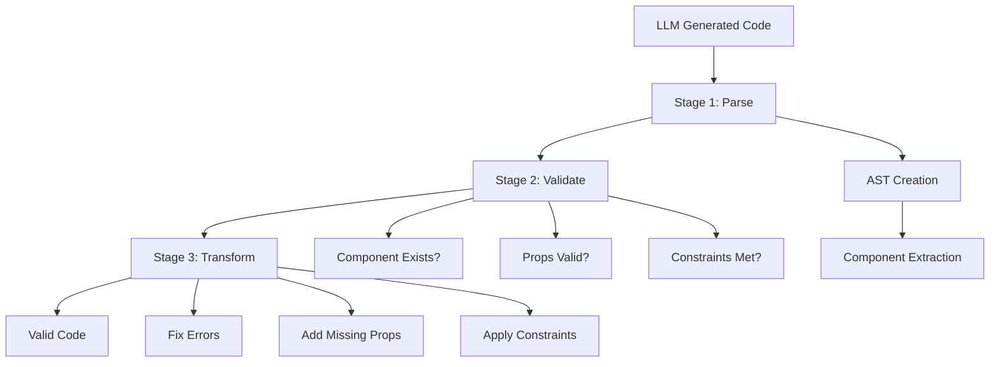

# DSIL Guide – Understanding and Using Design System Interface Layer

> A practical guide for working with DSIL

---

## Introduction

### Why DSIL?

Imagine you want to explain your design system to an LLM. You have three options:

**Option A: Dump everything raw**
```typescript
// 500+ lines of TypeScript interfaces
// 2000+ lines of Storybook documentation  
// → Costs ~50,000 tokens, LLM loses focus
```

**Option B: Give nothing**
```
// LLM "guesses" based on training
// → Generates generic Bootstrap/Tailwind code
// → Doesn't match your design system
```

**Option C: DSIL**
```dsil
// ~500-2000 tokens for a complete system
// Clear rules about what's allowed and what's not
// → LLM generates valid, system-conformant output
```

DSIL is Option C – an **intermediate language** that compresses design system knowledge without losing meaning.

---

## Core Concepts

### The Layered Model

```
┌─────────────────────────────────────────┐
│         LLM (GPT, Gemini, etc.)         │
├─────────────────────────────────────────┤
│              DSIL Manifest              │  ← You define this
├─────────────────────────────────────────┤
│            Design System                │
│    (Figma, Storybook, Code, Docs)       │
├─────────────────────────────────────────┤
│          React/Vue/Web Components       │
└─────────────────────────────────────────┘
```

DSIL sits between the LLM and the Design System. It **translates** the full complexity into an LLM-digestible format.

### The Five Pillars

| Pillar | What it describes | Example |
|--------|-------------------|---------|
| **@meta** | System identity | Name, version, config |
| **@tokens** | Atomic values | Colors, spacing, typography |
| **@components** | UI building blocks | Button, Card, Input |
| **@patterns** | Combination rules | "In Card-Footer max 3 Buttons" |
| **@semantics** | Intent mapping | "User selects 1 from N" → Radio/Select |

---

## Understanding Tokens

### What are Tokens?

Design tokens are the **atomic building blocks** of a design system – the smallest, non-divisible values.

```dsil
@tokens {
  spacing: {
    xs: "4px"    # Minimal spacing
    sm: "8px"    # Compact spacing
    md: "16px"   # Standard spacing
    lg: "24px"   # Generous spacing
    xl: "32px"   # Very generous spacing
  }
}
```

### Why Token References Instead of Values?

**Bad:**
```json
{ "padding": "16px", "gap": "8px" }
```

**Good:**
```dsil
{ padding: @ref(tokens.spacing.md), gap: @ref(tokens.spacing.sm) }
```

Benefits:
- LLM cannot use "invented" values
- Changes to the token system propagate automatically
- Validation becomes possible

### Token Categories

```dsil
@tokens {
  # Spatial
  spacing: [xs|sm|md|lg|xl|2xl]
  radius: [none|sm|md|lg|full]
  
  # Visual
  color.semantic: [primary|secondary|success|warning|error]
  color.neutral: [50|100|200|300|400|500|600|700|800|900]
  shadow: [none|sm|md|lg|xl]
  
  # Typographic
  font.size: [xs|sm|base|lg|xl|2xl|3xl]
  font.weight: [normal|medium|semibold|bold]
  font.family: [sans|serif|mono]
  
  # Temporal
  transition: [fast|normal|slow]
  
  # Responsive
  breakpoint: [mobile|tablet|desktop|wide]
}
```

---

## Defining Components

### Anatomy of a Component

```dsil
@component button {
  # 1. DOCUMENTATION
  @doc "Interactive element for user actions"
  
  # 2. VARIANTS – How does it look?
  variants: {
    intent: primary | secondary | ghost | danger
    size: sm | md | lg
  }
  
  # 3. STATES – What states can it be in?
  states: [default, hover, active, focus, disabled, loading]
  
  # 4. SLOTS – What can go inside?
  slots: {
    icon?: @type(icon)      # Optional
    label!: @type(text)     # Required
  }
  
  # 5. PROPS – Configuration
  props: {
    type?: "button" | "submit" | "reset"
    href?: @type(url)
  }
  
  # 6. EVENTS – What can happen?
  events: [onClick, onFocus, onBlur]
  
  # 7. CONSTRAINTS – What is forbidden?
  constraints: {
    @rule "ghost + danger → invalid"
    @rule "loading → disabled implicit"
  }
  
  # 8. USAGE – When to use?
  usage: {
    do: ["Primary for main CTA"]
    dont: ["Not multiple Primary buttons next to each other"]
  }
}
```

### Variants vs. States vs. Props

These three are often confused. Here's the distinction:

| Concept | Who decides? | When changeable? | Example |
|---------|-------------|------------------|---------|
| **Variant** | Developer | At implementation | `intent="primary"` |
| **State** | System/User | At runtime | `:hover`, `:disabled` |
| **Prop** | Developer | At implementation | `type="submit"` |

```dsil
# Variant: Static, defines appearance
<Button intent="primary" size="lg">

# State: Dynamic, changes
<Button disabled={isLoading}>  # disabled is a state

# Prop: Configuration without visual change
<Button type="submit">
```

### Understanding Slots

Slots define **what content** can go into a component:

```dsil
@component card {
  slots: {
    header?: @type(text | node)      # Optional, Text or JSX
    media?: @type(image | video)      # Optional, only media
    body!: @type(node)                # Required, any content
    footer?: {
      @type(node)
      @allows [button, link]          # Only specific components
      @max 3                          # Maximum 3 elements
    }
  }
}
```

**Slot Types:**

| Type | Meaning | Example |
|------|---------|---------|
| `text` | Plain text only | Labels, headings |
| `node` | Any JSX | Complex content |
| `icon` | Icon component | Lucide, HeroIcons |
| `image` | Image element | ``, `<Image>` |
| `component[]` | Specific components | `[button, link]` |

### Writing Constraints

Constraints are **rules** that prevent invalid combinations:

```dsil
constraints: {
  # Combination forbidden
  @rule "ghost + danger → invalid"
  
  # Implicit dependency
  @rule "loading → disabled implicit"
  
  # Conditional requirement
  @rule "icon alone → requires aria-label"
  
  # Slot restriction
  @rule "footer.buttons ≤ 3"
  
  # Context rule
  @rule "in modal → size:lg forbidden"
}
```

**Constraint Operators:**

| Operator | Meaning | Example |
|----------|---------|---------|
| `+` | AND combination | `ghost + danger` |
| `→` | Implies | `loading → disabled` |
| `\|` | OR | `primary \| secondary` |
| `≤` `≥` `=` | Comparison | `count ≤ 3` |
| `in` | Context | `in modal` |
| `alone` | Without other slots | `icon alone` |

---

## Patterns – Defining Compositions

### What is a Pattern?

A pattern describes how components are **used together**:

```dsil
@pattern card-actions {
  @doc "Action area of a card"
  
  # Where does this pattern live?
  container: card.footer
  
  # What's allowed inside?
  allows: {
    components: [button, link, icon-button]
    max: 3
  }
  
  # How is it arranged?
  layout: {
    direction: horizontal
    gap: @ref(token.spacing.sm)
    align: end
  }
  
  # Rules
  constraints: {
    @rule "max 1 primary button"
    @rule "primary → position last"
  }
}
```

### Structure Patterns

Some patterns define a **sequence**:

```dsil
@pattern form-field {
  # Fixed structure with optional parts
  structure: [
    label?           # 1. Optional: Label
    input!           # 2. Required: Input element
    helper?          # 3. Optional: Help text
    error?           # 4. Optional: Error message
  ]
  
  constraints: {
    @rule "error present → helper hidden"
  }
}
```

The LLM now knows: A form field has this structure, and if an error is displayed, the help text disappears.

### Responsive Patterns

```dsil
@pattern page-header {
  structure: [breadcrumb?, title!, subtitle?, actions?]
  
  responsive: {
    desktop: {
      layout: horizontal
      actions: "inline right"
    }
    mobile: {
      layout: vertical
      breadcrumb: hidden
      actions: "below title, full-width"
    }
  }
}
```

---

## Semantics – Intent Mapping

### The Most Powerful DSIL Feature

Semantics translate **user intentions** into component recommendations:

```dsil
@semantics {
  @intent "user selects one from options" {
    conditions: {
      options ≤ 4, space horizontal: → segmented-control
      options ≤ 7, space vertical: → radio-group  
      options > 7: → select
      options hierarchical: → tree-select
      options searchable: → combobox
    }
  }
}
```

### Why is this so valuable?

Without Semantics:
```
User: "I need a selection for countries"
LLM: *generates Select* (or Radio, or Dropdown – unclear)
```

With Semantics:
```
User: "I need a selection for countries (195 options, searchable)"
LLM: *reads: options > 7, searchable → combobox*
LLM: *generates Combobox with Search*
```

### Semantic Categories

```dsil
@semantics {
  
  # SELECTION
  @intent "select one" { ... }
  @intent "select multiple" { ... }
  @intent "toggle setting" { ... }
  
  # INPUT
  @intent "enter text" { ... }
  @intent "enter number" { ... }
  @intent "enter date" { ... }
  
  # FEEDBACK
  @intent "show success" { ... }
  @intent "show error" { ... }
  @intent "confirm action" { ... }
  
  # NAVIGATION
  @intent "navigate sections" { ... }
  @intent "paginate content" { ... }
  
  # LAYOUT
  @intent "group content" { ... }
  @intent "show/hide content" { ... }
}
```

---

## Compact Format for LLMs

### When to Use Compact?

- **Full Format**: Documentation, human readers, tooling
- **Compact Format**: LLM system prompts, token-critical contexts

### Conversion Rules

**Full:**
```dsil
@component button {
  @extends interactive
  variants: {
    intent: primary | secondary | ghost | danger
    size: sm | md | lg
  }
  slots: {
    icon?: @type(icon)
    label!: @type(text)
  }
  constraints: {
    @rule "ghost + danger → invalid"
  }
}
```

**Compact:**
```dsil
C.button<interactive>: v.intent[primary|secondary|ghost|danger] v.size[sm|md|lg] s[icon?,label!] !ghost+danger
```

### Compact Cheatsheet

```
# Prefixes
T. = Token
C. = Component  
P. = Pattern
S. = Semantic

# Attributes
v. = variant
sz. = size (shortcut for v.size)
s[] = slots
st[] = states
p. = props
e[] = events

# Modifiers
? = optional
! = required / constraint
→ = implies
≤ ≥ = comparison
|| = or
+ = and
- = removes/hides
```

---

## Practical Examples

### Example 1: Complete Accordion

```dsil
@component accordion {
  @doc "Expandable content container with multiple panels"
  
  variants: {
    mode: single | multi      # One or multiple open
    style: bordered | flush   # With/without border
  }
  
  states: [expanded, collapsed, disabled]
  
  slots: {
    items!: @type(array) {
      header!: @type(text | node)
      body!: @type(node)
      icon?: @type(icon)
      disabled?: @type(boolean)
      defaultOpen?: @type(boolean)
    }
  }
  
  props: {
    collapsible?: true       # Can all be closed?
  }
  
  events: {
    onToggle: { index: number, expanded: boolean }
    onExpandAll: {}
    onCollapseAll: {}
  }
  
  constraints: {
    @rule "mode:single → max 1 expanded"
    @rule "collapsible:false + mode:single → always 1 expanded"
  }
  
  a11y: {
    role: "region"
    @rule "header → button role"
    @rule "header → aria-expanded"
    @rule "body → aria-labelledby header"
  }
}

# Compact:
C.accordion: m[single|multi] style[bordered|flush] s.items[header!,body!,icon?,disabled?,defaultOpen?] e[onToggle(idx,expanded)] !single→max1.expanded
```

### Example 2: Complete Form Pattern

```dsil
@pattern login-form {
  @doc "Standard login form"
  
  structure: {
    fields: [
      @use form-field { input: input[type=email], label: "E-Mail" }
      @use form-field { input: input[type=password], label: "Password" }
    ]
    options?: [
      checkbox { label: "Stay signed in" }
      link { label: "Forgot password?", align: end }
    ]
    actions: [
      button { intent: primary, label: "Sign in", type: submit }
    ]
  }
  
  layout: {
    direction: vertical
    gap: @ref(token.spacing.lg)
    actions.align: stretch | end
  }
  
  validation: {
    email: @validate(email)
    password: @validate(minLength: 8)
  }
}
```

---

## Using DSIL with AI Tools

### System Prompt Template

When using DSIL with LLMs like ChatGPT, Claude, or Cursor, structure your prompt like this:

```
You are a frontend developer.

DESIGN SYSTEM:
[Paste DSIL Compact Format here]

RULES:
1. Only use components defined in the DSIL
2. Respect all constraints (marked with !)
3. Controlled components require state + handlers
4. When uncertain → check @semantics section
5. Use tokens for spacing, colors, etc. (T.spacing.md, etc.)
```

### Effective Prompts

**Vague:**
```
"Create a form"
```

**Specific:**
```
"Create a contact form with:
- Name (required), Email (required, validated)
- Message (multiline)
- Submit (Primary), Cancel (Secondary)"
```

### Using with Cursor

When working with Cursor (or similar AI coding assistants), you can:

1. **Add DSIL to your project context**:
   - Store your DSIL file in your project root
   - Reference it in `.cursorrules` or project documentation
   - Paste the Compact Format in the chat context when starting a session

2. **Example Cursor prompt**:
```
You are an expert in DSIL (Design System Interface Layer) – a format for describing design systems, optimized for LLM consumption.

## DSIL Syntax Quick Reference

### Structure
- Sections: @meta, @tokens, @icons, @types, @component, @patterns, @semantics
- Extensions: @i18n, @rtl, @animation, @a11y
- Decorators: @doc, @controlled, @deprecated, @since, @tag-react, @tag-html, @group, @rule, @alias

[Paste your DSIL Compact Format here]

Please generate UI code using ONLY the components and patterns defined in the DSIL above. Respect all constraints.
```

3. **Best practices for Cursor**:
   - Keep DSIL in Compact Format for token efficiency
   - Update DSIL when your design system changes
   - Test generated code against your actual components
   - Iteratively refine constraints based on LLM errors

---

## Best Practices

### DO ✓

1. **Start with Tokens** – They are the foundation
2. **Define Base Components** – `interactive`, `field`, `container`
3. **Write Constraints** – They prevent 90% of LLM errors
4. **Use Semantics** – Intent mapping is the biggest lever
5. **Test with Real Prompts** – Iterate based on LLM output
6. **Keep it Focused** – 10 well-defined components beat 50 overloaded ones
7. **Document Examples** – Show real usage patterns

### DON'T ✗

1. **Don't define everything** – Focus on frequently used components
2. **No implementation details** – DSIL describes WHAT, not HOW
3. **No styling details** – `color: #0066CC` doesn't belong in constraints
4. **Don't be too strict** – LLMs need flexibility for edge cases
5. **Don't invent props** – Only document what actually exists

### Token Budget

| System Size | Components | Recommended Budget |
|-------------|------------|-------------------|
| Minimal | 5-10 | 500-1000 tokens |
| Standard | 15-25 | 1500-3000 tokens |
| Enterprise | 40+ | 4000-8000 tokens |

Rule of thumb: **More Semantics, fewer component details** produces better results.

---

## Troubleshooting

### LLM Ignores Constraints

**Problem:** LLM generates `<Button intent="ghost" intent="danger">`

**Solution:** Make constraint more explicit:
```dsil
constraints: {
  @rule "intent: mutually exclusive, pick exactly one"
  @rule "ghost + danger combination: NEVER VALID"  # More explicit
}
```

### LLM Invents Variants

**Problem:** LLM generates `<Button intent="success">` (doesn't exist)

**Solution:** Add strict mode and make it explicit:
```dsil
@meta {
  config.strict: true
  config.allowCustom: false
}
```

And in the prompt: "Use ONLY variants defined in the DSIL manifest."

### LLM Chooses Wrong Component

**Problem:** LLM always uses `select` instead of `radio-group`

**Solution:** Strengthen semantic:
```dsil
@intent "select one" {
  @priority high  # Must be observed
  conditions: {
    options ≤ 5: → radio-group @confidence(0.9)
    options > 5: → select
  }
}
```

### LLM Uses Wrong Tokens

**Problem:** LLM uses `padding: "16px"` instead of token reference

**Solution:** Make tokens more explicit in examples:
```dsil
examples: {
  basic: |
    <Card padding={token.spacing.md}>
      Content
    </Card>
}
```

---

## Using RAG (Retrieval-Augmented Generation) with DSIL

### When to Use RAG?

RAG (Retrieval-Augmented Generation) becomes valuable when your DSIL manifest exceeds what can comfortably fit in a single LLM context window. Here's when to use it:

| System Size | Components | Tokens (Compact) | Recommendation |
|-------------|------------|------------------|-----------------|
| **Small** | 5-15 | 400-1,500 | ❌ **No RAG needed** - Include full DSIL in prompt |
| **Medium** | 15-30 | 1,500-3,000 | ⚠️ **Optional RAG** - Core in prompt, extended via RAG |
| **Enterprise** | 40+ | 3,000-6,000+ | ✅ **RAG recommended** - Core always, components retrieved |

**Decision Criteria:**

✅ **Use RAG if:**
- Your DSIL has 30+ components
- Context window is limited (< 8k tokens available)
- You need to support multiple design systems simultaneously
- DSIL changes frequently and you want dynamic updates
- You're building a production system with many users

❌ **Skip RAG if:**
- Your DSIL has < 15 components
- You have plenty of context window space (> 16k tokens)
- Simplicity is more important than scalability
- You're prototyping or testing

### Why Use RAG?

**Problem without RAG:**
```
Enterprise DSIL: 6,000 tokens (Compact Format)
User Query: 500 tokens
LLM Response: 1,000 tokens
Total: 7,500 tokens

→ Context window fills up quickly
→ Can't include conversation history
→ Can't reference other documents
```

**Solution with RAG:**
```
Core DSIL (always): 1,500 tokens
Retrieved Components: 800 tokens (only what's needed)
User Query: 500 tokens
LLM Response: 1,000 tokens
Total: 3,800 tokens

→ 50% token savings
→ Room for conversation history
→ Can reference other context
```

### What to Include in Core vs. RAG?

**Always in Core (Prompt):**
- `@meta` - System identity (small, critical)
- `@tokens` - All design tokens (referenced constantly)
- `@semantics` - All intent mappings (critical for decisions)
- `@patterns` - Common patterns (frequently used)
- Core Components (5-10 most used): button, input, text, link, etc.

**Via RAG (Retrieved on demand):**
- Extended Components (all others)
- Rare Patterns (specialized use cases)
- Extension Sections (`@i18n`, `@rtl`, `@animation`, `@a11y`) - only when needed

### Implementation Strategy

#### Step 1: Split Your DSIL

Create two files:

**`core.dsil`** - Always in prompt:
```dsil
@meta {
  name: "my-design-system"
  version: "1.0.0"
  # ... full meta
}

@tokens {
  # ALL tokens - always needed
  spacing: { ... }
  color: { ... }
  typography: { ... }
}

@semantics {
  # ALL semantics - critical for decisions
  @intent "user triggers action" { ... }
  @intent "user enters text" { ... }
  # ... all intents
}

@patterns {
  # Common patterns
  @pattern form-field { ... }
  @pattern button-group { ... }
}

# Core components (5-10 most used)
@component button { ... }
@component input { ... }
@component text { ... }
```

**`components/`** - Individual component files for RAG:
```
components/
├── card.dsil
├── dialog.dsil
├── select.dsil
└── ...
```

#### Step 2: Create Embeddings

```python
# Example: Python implementation
from openai import OpenAI
import json

client = OpenAI()

def create_dsil_embeddings(dsil_file_path):
    """Create embeddings for DSIL components"""
    
    # Read DSIL file
    with open(dsil_file_path, 'r') as f:
        content = f.read()
    
    # Create embedding
    response = client.embeddings.create(
        model="text-embedding-3-small",
        input=content
    )
    
    return {
        'content': content,
        'embedding': response.data[0].embedding,
        'component_name': extract_component_name(content),
        'metadata': {
            'type': 'component',
            'tokens': count_tokens(content)
        }
    }

# Index all components
components = []
for file in glob('components/*.dsil'):
    components.append(create_dsil_embeddings(file))

# Store in vector database (e.g., Pinecone, Weaviate, Chroma)
```

#### Step 3: Implement Retrieval

```python
def retrieve_dsil_context(user_query, vector_db, core_dsil):
    """
    Retrieve relevant DSIL components based on user query
    """
    # 1. Always include core
    context_parts = [core_dsil]
    
    # 2. Extract component mentions from query
    mentioned = extract_component_mentions(user_query)
    # e.g., "form with email input and submit button"
    # → ["input", "button"]
    
    # 3. Semantic search for related components
    query_embedding = create_embedding(user_query)
    semantic_matches = vector_db.similarity_search(
        query_embedding,
        top_k=5,
        filter={'type': 'component'}
    )
    
    # 4. Retrieve component definitions
    components_to_include = set(mentioned + [m['component_name'] for m in semantic_matches])
    
    for component_name in components_to_include:
        component_dsil = vector_db.get_by_name(component_name)
        context_parts.append(component_dsil['content'])
    
    # 5. Retrieve related patterns
    patterns = find_related_patterns(components_to_include)
    context_parts.extend(patterns)
    
    # 6. Convert to compact format
    return convert_to_compact('\n\n'.join(context_parts))
```

#### Step 4: Build System Prompt

```python
def build_system_prompt(retrieved_context, core_dsil):
    return f"""
You are a frontend developer using the {core_dsil['meta']['name']} design system.

CORE SYSTEM (always available):
{core_dsil['compact']}

RETRIEVED COMPONENTS (for this request):
{retrieved_context}

RULES:
1. Only use components from CORE SYSTEM or RETRIEVED COMPONENTS above
2. Always check @semantics section for component selection decisions
3. Use tokens from @tokens section (T.spacing.md, T.color.primary, etc.)
4. Respect all constraints (marked with !)
5. Controlled components require state management
6. If a component is not in the context above, it doesn't exist - don't use it

When in doubt, check the @semantics section for guidance on which component to use.
"""
```

### Complete Example: Python Implementation

See [`rag-implementation-example.py`](../examples/rag-implementation-example.py) for a complete, runnable Python implementation.

**Quick Start:**

```python
from rag_implementation_example import DSILRAG

# Initialize
rag = DSILRAG(
    core_dsil_path='dsil/core.dsil',
    components_dir='dsil/components'
)

# Build prompt
prompt = rag.build_system_prompt("Create a login form")
# Use prompt with LLM API
```

**Simplified Example:**

```python
"""
DSIL RAG Implementation Example
"""
import json
from typing import List, Dict
from openai import OpenAI
import chromadb  # or Pinecone, Weaviate, etc.

class DSILRAG:
    def __init__(self, core_dsil_path: str, components_dir: str):
        self.client = OpenAI()
        self.core_dsil = self.load_core_dsil(core_dsil_path)
        self.vector_db = chromadb.Client()
        self.collection = self.vector_db.create_collection("dsil_components")
        self.index_components(components_dir)
    
    def load_core_dsil(self, path: str) -> Dict:
        """Load core DSIL (meta, tokens, semantics, patterns, core components)"""
        with open(path, 'r') as f:
            content = f.read()
        return {
            'content': content,
            'compact': self.to_compact(content),
            'meta': self.parse_meta(content)
        }
    
    def index_components(self, components_dir: str):
        """Index all component files for retrieval"""
        import glob
        
        for file_path in glob.glob(f"{components_dir}/*.dsil"):
            with open(file_path, 'r') as f:
                content = f.read()
            
            # Extract component name
            component_name = self.extract_component_name(content)
            
            # Create embedding
            embedding = self.create_embedding(content)
            
            # Store in vector DB
            self.collection.add(
                ids=[component_name],
                embeddings=[embedding],
                documents=[content],
                metadatas=[{
                    'component': component_name,
                    'type': 'component',
                    'tokens': self.count_tokens(content)
                }]
            )
    
    def retrieve(self, user_query: str, top_k: int = 5) -> str:
        """Retrieve relevant components for user query"""
        
        # 1. Extract mentioned components
        mentioned = self.extract_components(user_query)
        
        # 2. Semantic search
        query_embedding = self.create_embedding(user_query)
        results = self.collection.query(
            query_embeddings=[query_embedding],
            n_results=top_k
        )
        
        # 3. Combine mentioned + semantic matches
        component_names = set(mentioned)
        for match in results['ids'][0]:
            component_names.add(match)
        
        # 4. Retrieve component definitions
        retrieved = []
        for name in component_names:
            result = self.collection.get(ids=[name])
            if result['documents']:
                retrieved.append(result['documents'][0])
        
        # 5. Convert to compact format
        return self.to_compact('\n\n'.join(retrieved))
    
    def build_prompt(self, user_query: str) -> str:
        """Build complete system prompt with core + retrieved"""
        
        retrieved = self.retrieve(user_query)
        
        return f"""
You are a frontend developer using the {self.core_dsil['meta']['name']} design system.

CORE SYSTEM:
{self.core_dsil['compact']}

RETRIEVED COMPONENTS:
{retrieved}

RULES:
1. Only use components from CORE SYSTEM or RETRIEVED COMPONENTS
2. Check @semantics for component selection
3. Use tokens (T.spacing.md, etc.)
4. Respect constraints (!)
5. Controlled components need state

User Request: {user_query}
"""
    
    def extract_components(self, query: str) -> List[str]:
        """Extract component names from query"""
        # Simple keyword matching (can be enhanced with NLP)
        components = []
        keywords = {
            'button': 'button',
            'input': 'input',
            'text field': 'text-field',
            'form': 'form',
            'card': 'card',
            'dialog': 'dialog',
            'modal': 'dialog',
            'select': 'select',
            'dropdown': 'select',
            'checkbox': 'checkbox',
            'radio': 'radio',
            'switch': 'switch',
            'toggle': 'switch',
        }
        
        query_lower = query.lower()
        for keyword, component in keywords.items():
            if keyword in query_lower:
                components.append(component)
        
        return components
    
    def create_embedding(self, text: str) -> List[float]:
        """Create embedding for text"""
        response = self.client.embeddings.create(
            model="text-embedding-3-small",
            input=text
        )
        return response.data[0].embedding
    
    def extract_component_name(self, content: str) -> str:
        """Extract component name from @component definition"""
        import re
        match = re.search(r'@component\s+(\S+)', content)
        return match.group(1) if match else 'unknown'
    
    def to_compact(self, content: str) -> str:
        """Convert DSIL to compact format (simplified)"""
        # In production, use proper DSIL converter
        # This is a placeholder
        return content  # Simplified
    
    def parse_meta(self, content: str) -> Dict:
        """Parse @meta section"""
        import re
        match = re.search(r'name:\s*"([^"]+)"', content)
        return {'name': match.group(1) if match else 'unknown'}
    
    def count_tokens(self, text: str) -> int:
        """Estimate token count"""
        return len(text.split()) * 1.3  # Rough estimate

# Usage
rag = DSILRAG(
    core_dsil_path='dsil/core.dsil',
    components_dir='dsil/components'
)

user_query = "Create a login form with email and password fields and a submit button"

system_prompt = rag.build_prompt(user_query)
# Use system_prompt with LLM API
```

### JavaScript/TypeScript Example

See [`rag-implementation-example.ts`](../examples/rag-implementation-example.ts) for a complete, runnable TypeScript implementation.

**Quick Start:**

```typescript
import { DSILRAG } from './rag-implementation-example';

// Initialize
const rag = new DSILRAG('dsil/core.dsil', 'dsil/components');

// Build prompt
const prompt = await rag.buildSystemPrompt('Create a login form');
// Use prompt with LLM API
```

**Simplified Example:**

```typescript
/**
 * DSIL RAG Implementation (TypeScript)
 */
import { OpenAI } from 'openai';
import { ChromaClient } from 'chromadb';

interface DSILComponent {
  name: string;
  content: string;
  embedding: number[];
  metadata: {
    type: 'component' | 'pattern';
    tokens: number;
  };
}

class DSILRAG {
  private client: OpenAI;
  private chroma: ChromaClient;
  private collection: any;
  private coreDSIL: string;

  constructor(coreDSILPath: string, componentsDir: string) {
    this.client = new OpenAI({ apiKey: process.env.OPENAI_API_KEY });
    this.chroma = new ChromaClient();
    this.coreDSIL = this.loadCoreDSIL(coreDSILPath);
    this.initializeCollection(componentsDir);
  }

  private async initializeCollection(componentsDir: string) {
    this.collection = await this.chroma.getOrCreateCollection({
      name: 'dsil_components',
      metadata: { description: 'DSIL component definitions' }
    });

    // Index components
    const files = await fs.readdir(componentsDir);
    for (const file of files) {
      if (file.endsWith('.dsil')) {
        await this.indexComponent(path.join(componentsDir, file));
      }
    }
  }

  private async indexComponent(filePath: string) {
    const content = await fs.readFile(filePath, 'utf-8');
    const componentName = this.extractComponentName(content);
    const embedding = await this.createEmbedding(content);

    await this.collection.add({
      ids: [componentName],
      embeddings: [embedding],
      documents: [content],
      metadatas: [{
        component: componentName,
        type: 'component',
        tokens: this.countTokens(content)
      }]
    });
  }

  async retrieve(userQuery: string, topK: number = 5): Promise<string> {
    // Extract mentioned components
    const mentioned = this.extractComponents(userQuery);

    // Semantic search
    const queryEmbedding = await this.createEmbedding(userQuery);
    const results = await this.collection.query({
      queryEmbeddings: [queryEmbedding],
      nResults: topK
    });

    // Combine mentioned + semantic matches
    const componentNames = new Set([
      ...mentioned,
      ...results.ids[0]
    ]);

    // Retrieve component definitions
    const retrieved = await this.collection.get({
      ids: Array.from(componentNames)
    });

    return this.toCompact(retrieved.documents.join('\n\n'));
  }

  buildPrompt(userQuery: string): Promise<string> {
    return this.retrieve(userQuery).then(retrieved => `
You are a frontend developer using the design system.

CORE SYSTEM:
${this.toCompact(this.coreDSIL)}

RETRIEVED COMPONENTS:
${retrieved}

RULES:
1. Only use components from CORE SYSTEM or RETRIEVED COMPONENTS
2. Check @semantics for component selection
3. Use tokens (T.spacing.md, etc.)
4. Respect constraints (!)

User Request: ${userQuery}
`);
  }

  private extractComponents(query: string): string[] {
    const keywords: Record<string, string> = {
      'button': 'button',
      'input': 'input',
      'text field': 'text-field',
      'form': 'form',
      'card': 'card',
      'dialog': 'dialog',
      'modal': 'dialog',
      'select': 'select',
      'checkbox': 'checkbox',
      'radio': 'radio',
      'switch': 'switch',
    };

    const found: string[] = [];
    const queryLower = query.toLowerCase();
    
    for (const [keyword, component] of Object.entries(keywords)) {
      if (queryLower.includes(keyword)) {
        found.push(component);
      }
    }

    return found;
  }

  private async createEmbedding(text: string): Promise<number[]> {
    const response = await this.client.embeddings.create({
      model: 'text-embedding-3-small',
      input: text
    });
    return response.data[0].embedding;
  }

  private extractComponentName(content: string): string {
    const match = content.match(/@component\s+(\S+)/);
    return match ? match[1] : 'unknown';
  }

  private toCompact(content: string): string {
    // Simplified - use proper converter in production
    return content;
  }

  private countTokens(text: string): number {
    return Math.ceil(text.split(/\s+/).length * 1.3);
  }

  private loadCoreDSIL(path: string): string {
    return fs.readFileSync(path, 'utf-8');
  }
}

// Usage
const rag = new DSILRAG('dsil/core.dsil', 'dsil/components');
const prompt = await rag.buildPrompt('Create a login form');
```

### Chunking Strategy

For optimal retrieval, chunk your DSIL intelligently:

**Option 1: Component-based (Recommended)**
```
Each @component definition = 1 chunk
- Good: Precise retrieval
- Good: Self-contained
- Bad: May miss related patterns
```

**Option 2: Section-based**
```
@tokens = 1 chunk
@semantics = 1 chunk
Each @component = 1 chunk
- Good: Logical grouping
- Bad: Tokens chunk always retrieved (waste)
```

**Option 3: Hybrid (Best for large systems)**
```
Core (always): @meta, @tokens, @semantics, @patterns
Component chunks: Each @component separately
Pattern chunks: Each @pattern separately
- Good: Flexible retrieval
- Good: Core always available
```

### Best Practices for RAG

1. **Always include Semantics in core**
   - Critical for component selection
   - Small token cost, huge value

2. **Index component names explicitly**
   - Make component names easily searchable
   - Include aliases in metadata

3. **Use semantic search + keyword matching**
   - Combine both approaches
   - Keyword for explicit mentions
   - Semantic for intent-based retrieval

4. **Monitor retrieval quality**
   - Log what gets retrieved
   - Track LLM errors from missing components
   - Adjust chunking/embedding as needed

5. **Cache frequently retrieved components**
   - Some components retrieved together often
   - Cache common combinations

### When NOT to Use RAG

Even for large systems, consider skipping RAG if:

- **Context window is large enough** (e.g., Claude 200k, GPT-4 128k)
- **System is stable** (DSIL doesn't change often)
- **Simplicity matters more** than token efficiency
- **You're prototyping** (premature optimization)

---

## Validating and Transforming LLM-Generated Code

### Why Validate?

Even with a well-defined DSIL manifest, LLMs can generate code that doesn't conform to your design system:

| Problem | Example | Impact |
|---------|---------|--------|
| **Hallucinated Components** | `<ButtonGroup>` (doesn't exist) | Runtime error |
| **Invalid Props** | `<Button color="blue">` (prop doesn't exist) | Type error |
| **Constraint Violations** | `<Button loading={true} disabled={false}>` | Violates "loading → disabled" |
| **Missing Handlers** | `<Modal open={true}>` without `onClose` | Runtime error |
| **Wrong Variants** | `<Button variant="success">` (only "primary", "secondary" exist) | Visual mismatch |
| **Framework Syntax** | React code when Vue was requested | Wrong framework |

**Solution:** Implement a validation pipeline that checks LLM-generated code against your DSIL manifest and automatically fixes common errors.

### The 3-Stage Validation Pipeline



**Stage 1: Parse**
- Convert code to Abstract Syntax Tree (AST)
- Extract component usages, props, variants
- Identify framework (React, Vue, Angular)

**Stage 2: Validate**
- Check component names exist in DSIL
- Validate props against component definitions
- Verify variant values are valid
- Check constraints are satisfied
- Ensure required props/handlers are present

**Stage 3: Transform**
- Remove invalid props
- Fix invalid variant values
- Apply constraint fixes (e.g., `loading → disabled`)
- Add missing required props
- Convert component names (framework-specific)
- Fix syntax errors

### Quick Validation Checklist

Before accepting LLM-generated code, verify:

- [ ] All component names exist in DSIL
- [ ] All props are defined for their components
- [ ] Variant values match allowed options
- [ ] Constraints are satisfied (e.g., `loading → disabled`)
- [ ] Required props are present
- [ ] Controlled components have event handlers
- [ ] Framework syntax is correct
- [ ] Token references are used (not hardcoded values)

### Common Validation Errors and Fixes

#### Error: Unknown Component

**Problem:**
```tsx
<ButtonGroup>
  <Button>Save</Button>
  <Button>Cancel</Button>
</ButtonGroup>
```

**Fix:** Replace with valid component or pattern:
```tsx
<div className="button-group">
  <Button>Save</Button>
  <Button>Cancel</Button>
</div>
```

#### Error: Invalid Prop

**Problem:**
```tsx
<Button color="blue">Click me</Button>
```

**Fix:** Remove invalid prop or use valid variant:
```tsx
<Button variant="primary">Click me</Button>
```

#### Error: Constraint Violation

**Problem:**
```tsx
<Button loading={true} disabled={false}>Save</Button>
```

**Fix:** Apply constraint automatically:
```tsx
<Button loading={true} disabled={true}>Save</Button>
```

#### Error: Missing Required Handler

**Problem:**
```tsx
<Modal open={isOpen}>
  Content
</Modal>
```

**Fix:** Add required handler:
```tsx
<Modal open={isOpen} onClose={() => setIsOpen(false)}>
  Content
</Modal>
```

#### Error: Invalid Variant Value

**Problem:**
```tsx
<Button variant="success">Save</Button>
```

**Fix:** Use valid variant or default:
```tsx
<Button variant="primary">Save</Button>
```

### Validation Approaches

#### 1. AST-Based Validation (Recommended)

**Pros:**
- Precise parsing
- Framework-aware
- Handles complex syntax
- Can transform code accurately

**Cons:**
- More complex to implement
- Requires framework-specific parsers

**Use when:** Production systems, complex code, multiple frameworks

#### 2. Regex-Based Validation (Simple)

**Pros:**
- Easy to implement
- Fast execution
- Language-agnostic

**Cons:**
- Less precise
- May miss edge cases
- Harder to transform code

**Use when:** Quick validation, simple code, prototyping

#### 3. LLM Self-Correction (Hybrid)

**Pros:**
- Handles complex cases
- Understands context
- Can fix multiple issues at once

**Cons:**
- Slower (requires LLM call)
- May introduce new errors
- Costs tokens

**Use when:** Complex errors, AST/regex can't fix, fallback option

#### 4. Hybrid Approach (Best Practice)

Combine all three:
1. **Quick regex check** for obvious errors
2. **AST validation** for precise checking
3. **LLM correction** for complex cases

```python
def validate_and_fix(code, dsil):
    # Step 1: Quick regex check
    quick_errors = regex_validate(code, dsil)
    if quick_errors:
        code = quick_fix(code, quick_errors)
    
    # Step 2: AST validation
    ast_result = ast_validate(code, dsil)
    if ast_result.valid:
        return code
    
    # Step 3: LLM correction (if needed)
    if ast_result.complex_errors:
        code = llm_correct(code, dsil, ast_result.errors)
    
    return code
```

### Integration with Existing Workflows

#### After LLM Generation

```typescript
// Generate code with LLM
const generatedCode = await llm.generate(userQuery, dsilPrompt);

// Validate and fix
const validator = new DSILCodeValidator(dsilManifest);
const result = await validator.validateAndFix(generatedCode);

if (result.valid) {
  // Use code
  return result.code;
} else {
  // Show errors or retry
  console.error(result.errors);
  return result.fixedCode; // Use fixed version
}
```

#### In CI/CD Pipeline

```yaml
# .github/workflows/validate-dsil.yml
- name: Validate DSIL Compliance
  run: |
    python validate_dsil.py --code generated/ --dsil dsil/manifest.dsil
```

#### In Development Tools

```typescript
// VS Code extension
const diagnostics = validateCode(document.getText(), dsilManifest);
vscode.languages.createDiagnosticCollection('dsil').set(
  document.uri,
  diagnostics
);
```

### Practical Examples

#### Example 1: Simple Validation

```typescript
import { DSILCodeValidator } from './dsil-validator';

const dsil = {
  components: {
    button: {
      props: { variant: ['primary', 'secondary'], disabled: 'boolean' },
      constraints: ['loading → disabled']
    }
  }
};

const code = `
  <Button loading={true} disabled={false}>
    Save
  </Button>
`;

const validator = new DSILCodeValidator(dsil);
const result = validator.validate(code);

// Result:
// {
//   valid: false,
//   errors: [{
//     type: 'CONSTRAINT_VIOLATION',
//     message: 'loading → disabled constraint violated',
//     fix: 'Set disabled={true}'
//   }],
//   fixedCode: '<Button loading={true} disabled={true}>Save</Button>'
// }
```

#### Example 2: Multi-Component Validation

```typescript
const code = `
  <Form>
    <TextField label="Email" type="email" />
    <TextField label="Password" type="password" />
    <Button variant="primary">Submit</Button>
  </Form>
`;

const result = validator.validate(code);

// Validates:
// - Form component exists
// - TextField components exist
// - All props are valid
// - Button variant is valid
// - Required props present
```

#### Example 3: Framework Conversion

```typescript
const reactCode = `
  <Button variant="primary" onClick={handleClick}>
    Click me
  </Button>
`;

const converter = new FrameworkConverter(dsil);
const vueCode = converter.convert(reactCode, 'react', 'vue');

// Result:
// <PButton variant="primary" @click="handleClick">
//   Click me
// </PButton>
```

### Best Practices

1. **Validate Early** - Check code immediately after LLM generation
2. **Auto-Fix When Possible** - Apply safe fixes automatically
3. **Clear Error Messages** - Help developers understand issues
4. **Log Validation Results** - Track common errors to improve DSIL
5. **Support Incremental Validation** - Validate only changed parts
6. **Cache Results** - Don't re-validate unchanged code
7. **Fallback to LLM** - Use LLM correction for complex cases

### Next Steps

1. **Choose Validation Approach** - AST, regex, or hybrid
2. **Implement Validator** - See examples in `code-validation-example.ts` and `code-validation-example.py`
3. **Integrate into Workflow** - Add to CI/CD or development tools
4. **Iterate** - Refine validation based on common errors

---

## Next Steps

1. **Read the Spec**: Complete syntax in [`DSIL-SPEC-v1.0.md`](../specs/DSIL-SPEC-v1.0.md)
2. **See Examples**: Check [`examples/`](../examples/) directory
3. **Create Your Own**: Use [`starter-template.md`](../examples/starter-template.md)
4. **Read Reference**: Comprehensive details in [`DSIL-REFERENCE.md`](DSIL-REFERENCE.md)
5. **Implement RAG**: Use the examples above for your system

---

*DSIL v1.0 – Design System Interface Layer*  
*For more information, see the [Specification](../specs/DSIL-SPEC-v1.0.md) and [Complete Reference](DSIL-REFERENCE.md)*
