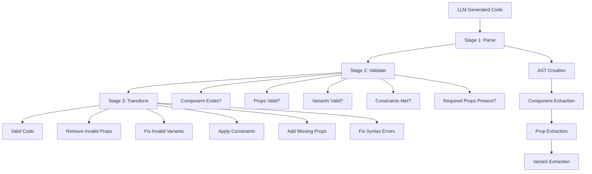

# DSIL – Design System Interface Layer

## Complete Reference Documentation v1.0

> **Version**: 1.0.0  
> **Date**: 2026-01-07  
> **Authors**: Chris Bordeck (MSQ DX / United Digital Group)  
> **License**: MIT

---

## Table of Contents

1. [Introduction](#1-introduction)
2. [Core Sections](#2-core-sections)
3. [Extension Sections](#3-extension-sections)
4. [Syntax Reference](#4-syntax-reference)
5. [Compact Format](#5-compact-format)
6. [Best Practices](#6-best-practices)
7. [Complete Examples](#7-complete-examples)
8. [Token Budget Guidelines](#8-token-budget-guidelines)
9. [Glossary](#9-glossary)
10. [RAG (Retrieval-Augmented Generation) Integration](#10-rag-retrieval-augmented-generation-integration)
11. [Code Validation & Transformation](#11-code-validation--transformation)

---

## 1. Introduction

### 1.1 What is DSIL?

**DSIL (Design System Interface Layer)** is a domain-specific language for describing design systems in a format optimized for Large Language Models (LLMs). Think of DSIL as a "contract" between your design system and AI assistants: it precisely defines which components exist, how they may be used, and when which component is the right choice.

```
┌─────────────────────────────────────────────────────────────┐
│                    Design System                            │
│  (Figma, Storybook, Code, Documentation)                    │
└─────────────────────┬───────────────────────────────────────┘
                      │
                      ▼
┌─────────────────────────────────────────────────────────────┐
│                      DSIL Manifest                          │
│  (Structured, token-optimized description)                  │
└─────────────────────┬───────────────────────────────────────┘
                      │
                      ▼
┌─────────────────────────────────────────────────────────────┐
│                    LLM / AI Assistant                       │
│  (Generates valid, consistent code)                         │
└─────────────────────────────────────────────────────────────┘
```

### 1.2 The Problem

When developers ask LLMs to generate UI code with a design system, typical errors occur:

| Problem | Example | Impact |
|---------|---------|--------|
| **Invented Props** | `<Button color="blue">` | Prop doesn't exist |
| **Invalid Combinations** | `<Button variant="primary" variant="ghost">` | Invalid code |
| **Missing Handlers** | `<Modal open={true}>` without `onClose` | Runtime error |
| **Wrong Component** | `<Dropdown>` instead of `<Select>` | Component doesn't exist |
| **Outdated API** | `<Button type="submit">` | Deprecated since v2.0 |

**Why does this happen?**

1. **LLMs hallucinate**: They "invent" plausible-sounding props
2. **Documentation is scattered**: Props here, examples there, constraints nowhere
3. **No explicit rules**: "disabled when loading" is never written down
4. **Token waste**: Long docs consume context window

### 1.3 The Solution

DSIL solves these problems through:

| Solution | Description |
|----------|-------------|
| **Explicit Constraints** | Rules like "loading → disabled" are codified |
| **Semantic Mappings** | "When to use Select vs. Radio?" is defined |
| **Token Efficiency** | Compact format saves 80% of tokens |
| **Single Source of Truth** | Everything in one place, structured |
| **Validatable** | Output can be validated against schema |

---

## 2. Core Sections

### 2.1 @meta

The `@meta` section defines the identity of the design system:

```dsil
@meta {
  name: "system-name"
  version: "1.0.0"
  dsil-version: "1.0.0"
  description: "Description of the system"
  
  prefix: {
    html: "p-"        # <p-button>
    react: "P"        # <PButton>
    angular: "p-"     # <p-button>
    vue: "P"          # <PButton>
  }
  
  imports: {
    react: "@package/components-react"
    angular: "@package/components-angular"
    vue: "@package/components-vue"
    vanilla: "@package/components-js"
    styles: "@package/tokens"
  }
  
  config: {
    strict: true      # Only defined values allowed
    controlled: true  # Mark controlled components
    theme: "light"    # Default theme
    allowCustom: false  # Disallow custom props
  }
  
  links: {
    documentation: "https://docs.example.com"
    figma: "https://figma.com/..."
    storybook: "https://storybook.example.com"
    github: "https://github.com/..."
  }
}
```

**Required fields:**
- `name`: System identifier
- `version`: System version
- `dsil-version`: DSIL format version
- `prefix`: Framework prefixes

**Optional fields:**
- `description`: Human-readable description
- `imports`: Package import paths per framework
- `config`: System-wide configuration
- `links`: External documentation links

### 2.2 @tokens

Design tokens are atomic values:

```dsil
@tokens {
  theme: {
    values: [light, dark, auto]
    default: "light"
  }
  
  spacing: {
    @group static {
      4: { value: "4px", css: "$spacing-4" }
      8: { value: "8px", css: "$spacing-8" }
      16: { value: "16px", css: "$spacing-16" }
      24: { value: "24px", css: "$spacing-24" }
      32: { value: "32px", css: "$spacing-32" }
    }
    
    @group fluid {
      sm: { css: "$spacing-fluid-sm", tailwind: "p-fluid-sm" }
      md: { css: "$spacing-fluid-md", tailwind: "p-fluid-md" }
      lg: { css: "$spacing-fluid-lg", tailwind: "p-fluid-lg" }
    }
  }
  
  color: {
    @group brand {
      primary: { value: "#D5001C", css: "$color-primary" }
      secondary: { value: "#000000", css: "$color-secondary" }
    }
    
    @group semantic {
      success: { value: "#018A16", css: "$color-success" }
      warning: { value: "#FF9B00", css: "$color-warning" }
      error: { value: "#E00000", css: "$color-error" }
      info: { value: "#0061BD", css: "$color-info" }
    }
    
    @group neutral {
      50: { value: "#FAFAFA", css: "$neutral-50" }
      100: { value: "#F5F5F5", css: "$neutral-100" }
      # ... more shades
      900: { value: "#171717", css: "$neutral-900" }
    }
  }
  
  typography: {
    family: {
      sans: { value: "'Porsche Next', Arial, sans-serif" }
      mono: { value: "'Courier New', monospace" }
    }
    
    scale: {
      sm: { value: "14px", css: "$text-sm" }
      base: { value: "16px", css: "$text-base", default: true }
      lg: { value: "18px", css: "$text-lg" }
      xl: { value: "24px", css: "$text-xl" }
      2xl: { value: "32px", css: "$text-2xl" }
    }
    
    weight: {
      normal: { value: 400, css: "$font-normal" }
      medium: { value: 500, css: "$font-medium" }
      semibold: { value: 600, css: "$font-semibold" }
      bold: { value: 700, css: "$font-bold" }
    }
  }
  
  breakpoint: {
    base: { value: "0px" }
    s: { value: "760px" }
    m: { value: "1000px" }
    l: { value: "1300px" }
    xl: { value: "1600px" }
  }
  
  border: {
    radius: {
      none: { value: "0px", css: "$radius-none" }
      sm: { value: "4px", css: "$radius-sm" }
      md: { value: "8px", css: "$radius-md" }
      lg: { value: "12px", css: "$radius-lg" }
      full: { value: "9999px", css: "$radius-full" }
    }
    width: {
      none: { value: "0px" }
      thin: { value: "1px" }
      medium: { value: "2px" }
      thick: { value: "4px" }
    }
  }
  
  shadow: {
    none: { value: "none", css: "$shadow-none" }
    sm: { value: "0 1px 2px rgba(0,0,0,0.05)", css: "$shadow-sm" }
    md: { value: "0 4px 6px rgba(0,0,0,0.1)", css: "$shadow-md" }
    lg: { value: "0 10px 15px rgba(0,0,0,0.1)", css: "$shadow-lg" }
    xl: { value: "0 20px 25px rgba(0,0,0,0.15)", css: "$shadow-xl" }
  }
  
  motion: {
    duration: {
      instant: { value: "0ms", css: "$duration-instant" }
      short: { value: "150ms", css: "$duration-short" }
      moderate: { value: "250ms", css: "$duration-moderate" }
      long: { value: "400ms", css: "$duration-long" }
    }
    easing: {
      base: { value: "cubic-bezier(0.25, 0.1, 0.25, 1)" }
      ease-out: { value: "cubic-bezier(0, 0, 0.2, 1)" }
      ease-in: { value: "cubic-bezier(0.4, 0, 1, 1)" }
      ease-in-out: { value: "cubic-bezier(0.4, 0, 0.2, 1)" }
    }
  }
  
  zIndex: {
    base: { value: 0 }
    dropdown: { value: 1000 }
    sticky: { value: 1020 }
    fixed: { value: 1030 }
    modal-backdrop: { value: 1040 }
    modal: { value: 1050 }
    popover: { value: 1060 }
    tooltip: { value: 1070 }
  }
}
```

**Token Structure:**
- Use `@group` to organize related tokens
- Include `value` for the actual value
- Include `css` for CSS variable/scss reference
- Include `tailwind` for Tailwind class names (optional)
- Mark default values with `default: true`

### 2.3 @icons

Available icons, grouped by usage:

```dsil
@icons {
  @group navigation {
    arrow-up, arrow-down, arrow-left, arrow-right
    arrow-up-right, arrow-down-right
    external, return, logout, home
    chevron-up, chevron-down, chevron-left, chevron-right
    menu, close, back, forward
  }
  
  @group action {
    add, edit, delete, save, copy, cut, paste
    search, filter, sort, refresh, reload
    download, upload, share, print
    check, cross, plus, minus
  }
  
  @group status {
    information, information-filled
    success, success-filled
    warning, warning-filled
    error, error-filled
    spinner, loading, progress
  }
  
  @group user {
    user, user-filled
    settings, preferences, profile
    heart, heart-filled
    star, star-filled
    bookmark, bookmark-filled
  }
  
  @group social {
    facebook, twitter, linkedin, instagram
    youtube, github, email
  }
  
  special: {
    none: { @doc "No icon" }
    inherit: { @doc "Inherit from parent" }
  }
}
```

**Icon Naming:**
- Use kebab-case (e.g., `arrow-left`, not `arrowLeft`)
- Group by semantic meaning, not visual similarity
- Include filled/outline variants explicitly

### 2.4 @types

Reusable type definitions:

```dsil
@types {
  @type Theme {
    values: [light, dark, auto]
    default: light
    @doc "Theme setting for components"
  }
  
  @type FormState {
    values: [none, success, error]
    default: none
    @doc "Form field validation state"
  }
  
  @type Size {
    values: [small, medium, large]
    default: medium
    @doc "Component size variant"
  }
  
  @type IconName {
    @doc "All available icon names"
    definition: "@ref(icons.*)"
    special: none
  }
  
  @type BreakpointCustomizable<T> {
    @doc "Responsive values per breakpoint"
    definition: T | {
      base?: T
      s?: T
      m?: T
      l?: T
      xl?: T
    }
    example: |
      // Simple
      compact={true}
      
      // Responsive
      compact={{ base: true, m: false }}
  }
  
  @type ResponsiveValue<T> {
    @doc "Alias for BreakpointCustomizable"
    definition: "@type(BreakpointCustomizable<T>)"
  }
}
```

**Type Definitions:**
- Use `@type TypeName` for type definitions
- Support generics with `<T>` syntax
- Use `@ref()` to reference other sections
- Provide examples when helpful

### 2.5 @component

The central section – component definitions:

```dsil
@component p-button {
  # Metadata
  @doc "Interactive button for user actions"
  @controlled false
  @since "1.0.0"
  @tag-react PButton
  @tag-html p-button
  
  # Variants (mutually exclusive)
  variants: {
    variant: {
      primary: { @doc "Main action – max. 1 per viewport" }
      secondary: { @doc "Secondary action" }
      tertiary: { @doc "Tertiary action" }
      ghost: { @doc "Minimal appearance" }
      danger: { @doc "Destructive action" }
    }
    size: {
      small: { @doc "Compact" }
      medium: { @doc "Standard", default: true }
      large: { @doc "Prominent" }
    }
  }
  
  # Properties
  props: {
    variant: {
      type: "primary" | "secondary" | "tertiary" | "ghost" | "danger"
      default: "primary"
    }
    size: {
      type: @type(BreakpointCustomizable<"small" | "medium" | "large">)
      default: "medium"
    }
    disabled: {
      type: boolean
      default: false
    }
    loading: {
      type: boolean
      default: false
      @doc "Shows spinner, implies disabled"
    }
    icon: {
      type: @type(IconName)
      @doc "Icon left of label"
    }
    hideLabel: {
      type: boolean
      default: false
      @doc "Show only icon"
    }
    type: {
      type: "button" | "submit" | "reset"
      default: "button"
    }
    theme: {
      type: @type(Theme)
      default: "light"
    }
  }
  
  # Slots (Content-Insertion-Points)
  slots: {
    default: {
      required: true
      type: text
      @doc "Button label"
    }
    icon: {
      required: false
      type: @type(IconName)
      @doc "Alternative to icon prop"
    }
  }
  
  # Events
  events: {
    click: { 
      native: true
      @doc "Native click event"
    }
    focus: { native: true }
    blur: { native: true }
  }
  
  # Constraints (CRITICAL for LLMs!)
  constraints: {
    @rule "loading implies disabled" {
      error: "Button with loading=true is automatically disabled"
    }
    @rule "hideLabel requires icon" {
      error: "Icon-only button needs icon prop or icon slot"
    }
    @rule "hideLabel requires aria-label" {
      error: "Icon-only buttons need aria-label for accessibility"
    }
    @rule "maximal one Primary per Viewport" {
      error: "Only one Primary button per visible area"
    }
    @rule "ghost + danger → invalid" {
      error: "Ghost and danger variants cannot be combined"
    }
  }
  
  # Accessibility
  a11y: {
    role: "button"
    focusable: true
    rules: [
      "Enter/Space activates",
      "Focus ring visible",
      "Icon-only needs aria-label"
    ]
  }
  
  # Usage Guidelines
  usage: {
    do: [
      "Primary for most important action",
      "Action-oriented labels (Verb + Object)",
      "Loading state for async actions"
    ]
    dont: [
      "More than one Primary per viewport",
      "Generic labels like 'Click'",
      "Button for navigation (use Link)"
    ]
  }
  
  # Examples
  examples: {
    basic: |
      <PButton>Save</PButton>
      <PButton variant="secondary">Cancel</PButton>
      <PButton variant="tertiary">Learn more</PButton>
    
    with-icon: |
      <PButton icon="add">Add item</PButton>
      <PButton icon="download" variant="secondary">Download</PButton>
    
    loading: |
      <PButton loading>Saving...</PButton>
      <PButton loading variant="secondary">Processing...</PButton>
    
    icon-only: |
      <PButton icon="close" hideLabel aria={{ label: "Close" }}>
        Close
      </PButton>
    
    responsive-size: |
      <PButton size={{ base: "small", m: "medium", l: "large" }}>
        Responsive Button
      </PButton>
  }
}
```

**Controlled Components:**

Components requiring external state management:

```dsil
@component p-modal {
  @doc "Modal dialog"
  @controlled true    # ← Marked as Controlled
  
  props: {
    open: {
      type: boolean
      required: true  # ← Required!
      @doc "Controls visibility"
    }
    heading: { type: string }
    size: { type: "small" | "medium" | "large", default: "medium" }
  }
  
  slots: {
    default: { required: true, type: node }
    footer: { required: false, type: node }
  }
  
  events: {
    dismiss: {
      payload: {}
      @doc "Fired when user attempts to close"
      handling: |
        // MUST be handled:
        const [open, setOpen] = useState(false);
        
        <PModal 
          open={open}
          onDismiss={() => setOpen(false)}
        >
          Content
        </PModal>
    }
  }
  
  constraints: {
    @rule "dismiss must be handled" {
      error: "Modal requires onDismiss handler"
      critical: true
    }
  }
}
```

### 2.6 @pattern

Patterns define reusable composition patterns:

```dsil
@patterns {
  @pattern form-field {
    @doc "Standard form field structure"
    
    structure: [label?, field!, helper?, error?]
    
    components: {
      label: "p-text[weight:semi-bold]"
      field: "p-input | p-select | p-textarea"
      helper: "p-text[size:small]"
      error: "p-text[size:small, color:error]"
    }
    
    constraints: {
      @rule "error replaces helper"
      @rule "required field needs label"
      @rule "error state requires error message"
    }
    
    implementation: |
      <div className="form-field">
        <PText weight="semi-bold" tag="label">{label}</PText>
        <PTextFieldWrapper state={error ? 'error' : state}>
          <PInput {...inputProps} />
        </PTextFieldWrapper>
        {error ? (
          <PText size="small" color="notification-error">{error}</PText>
        ) : helper && (
          <PText size="small">{helper}</PText>
        )}
      </div>
  }
  
  @pattern button-actions {
    @doc "Button group at end of forms/dialogs"
    
    structure: [secondary?, primary!]
    
    constraints: {
      @rule "Primary right"
      @rule "Maximum 2 buttons"
      @rule "Maximum 1 primary"
    }
    
    implementation: |
      <div className="button-actions">
        <PButton variant="secondary">Cancel</PButton>
        <PButton variant="primary">Save</PButton>
      </div>
  }
  
  @pattern modal-confirmation {
    @doc "Confirmation dialog"
    
    structure: [heading!, message!, actions!]
    
    components: {
      actions: "@pattern(button-actions)"
    }
    
    constraints: {
      @rule "Warning notification before actions"
      @rule "Actions use button-actions pattern"
    }
  }
  
  @pattern empty-state {
    @doc "Placeholder when no data"
    
    structure: [icon?, heading!, description?, action?]
    
    implementation: |
      <div className="empty-state">
        {icon && <PIcon name={icon} size="xl" />}
        <PHeading>{heading}</PHeading>
        {description && <PText>{description}</PText>}
        {action && <PButton>{action}</PButton>}
      </div>
  }
}
```

### 2.7 @semantics

Semantics define **when to use which component**:

```dsil
@semantics {
  @intent "user selects one from multiple options" {
    @alias "single select", "choose one"
    
    decision-tree: |
      Number of options?
      ├─ ≤ 3 → radio-button-group
      ├─ 4-7 → radio-button-group (if space) or select
      └─ > 7 → select (with search if >15)
    
    conditions: {
      "≤ 5 options, space available": {
        component: "p-radio-button-group"
        reason: "All options immediately visible"
      }
      "> 5 options": {
        component: "p-select"
        reason: "Saves space"
      }
      "binary (yes/no), immediate effect": {
        component: "p-switch"
        reason: "Toggle without submit"
      }
      "binary (yes/no), form submit": {
        component: "p-checkbox"
        reason: "Part of a form"
      }
    }
  }
  
  @intent "user triggers action" {
    @alias "button click", "action", "cta"
    
    conditions: {
      "primary action": {
        component: "p-button[variant:primary]"
        reason: "Most important action"
      }
      "secondary action": {
        component: "p-button[variant:secondary]"
      }
      "navigation to URL": {
        component: "p-link"
        reason: "Links for navigation, Buttons for actions!"
      }
      "destructive action": {
        component: "p-button[variant:danger] + @pattern(modal-confirmation)"
        reason: "Needs confirmation"
      }
    }
  }
  
  @intent "system shows feedback" {
    conditions: {
      "temporary, non-blocking": {
        component: "p-toast"
        reason: "Disappears automatically"
      }
      "important, needs action": {
        component: "p-banner"
        reason: "Stays visible"
      }
      "inline in content": {
        component: "p-inline-notification"
      }
      "blocking, critical": {
        component: "p-modal[role:alertdialog]"
      }
    }
  }
  
  @intent "content show/hide" {
    conditions: {
      "FAQ-style": {
        component: "p-accordion"
      }
      "Tooltip (hover)": {
        component: "p-tooltip"
      }
      "Popover (click)": {
        component: "p-popover"
      }
      "Fullscreen overlay": {
        component: "p-modal"
      }
      "Side panel": {
        component: "p-flyout"
      }
    }
  }
}
```

---

## 3. Extension Sections

### 3.1 @i18n

Internationalization support:

```dsil
@i18n {
  config: {
    defaultLocale: "en"
    supportedLocales: ["de", "en", "fr", "es", "it"]
    rtlLocales: ["ar", "he", "fa"]
    fallbackLocale: "en"
  }
  
  components: {
    p-pagination: {
      intl-keys: {
        prev: { default: "Previous", de: "Zurück", fr: "Précédent" }
        next: { default: "Next", de: "Weiter", fr: "Suivant" }
        page: { default: "Page", de: "Seite", fr: "Page" }
        of: { default: "of", de: "von", fr: "sur" }
      }
      
      example: |
        <PPagination 
          intl={{ 
            prev: 'Zurück', 
            next: 'Weiter',
            page: 'Seite',
            of: 'von'
          }} 
        />
    }
    
    p-select: {
      intl-keys: {
        noResults: { default: "No results", de: "Keine Ergebnisse" }
        clear: { default: "Clear", de: "Löschen" }
        search: { default: "Search...", de: "Suchen..." }
      }
    }
    
    p-modal: {
      intl-keys: {
        close: { default: "Close", de: "Schließen" }
      }
    }
  }
  
  constraints: {
    @rule "intl prop overrides defaults"
    @rule "Missing keys → fallback to default locale"
    @rule "Placeholders like {count} must be preserved"
  }
}
```

### 3.2 @rtl

Right-to-Left language support:

```dsil
@rtl {
  activation: '<html dir="rtl" lang="ar">'
  
  directional-icons: {
    mirrored: [arrow-left, arrow-right, chevron-left, chevron-right, external, return]
    preserved: [arrow-up, arrow-down, check, close, add, search, heart, star]
  }
  
  components: {
    p-button: ["Icon changes side"]
    p-tabs: ["Tab order inverted"]
    p-flyout: ["position:start → opens from right"]
    p-modal: ["Close button on left"]
    p-input-*: ["Label right, text RTL"]
    p-carousel: ["Slides RTL, buttons swapped"]
  }
  
  css-guidelines: [
    "Use margin-inline-start instead of margin-left",
    "Use padding-inline-end instead of padding-right",
    "Tailwind: ms-4 instead of ml-4",
    "Use logical properties (inset-inline-start, etc.)"
  ]
}
```

### 3.3 @animation

Animations and motion:

```dsil
@animation {
  tokens: {
    duration: {
      instant: { value: "0ms" }
      short: { value: "150ms" }
      moderate: { value: "250ms" }
      long: { value: "400ms" }
    }
    easing: {
      ease-out: { value: "cubic-bezier(0, 0, 0.2, 1)" }
      base: { value: "cubic-bezier(0.25, 0.1, 0.25, 1)" }
      ease-in: { value: "cubic-bezier(0.4, 0, 1, 1)" }
    }
  }
  
  reduced-motion: {
    @doc "Respects prefers-reduced-motion"
    behavior: [
      "Decorative animations disabled",
      "Functional transitions instant",
      "Loading animations remain"
    ]
  }
  
  components: {
    p-modal: {
      animations: {
        backdrop-fade: { property: "opacity", duration: "moderate" }
        content-scale: { property: "transform, opacity", duration: "moderate" }
      }
    }
    p-accordion: {
      animations: {
        expand: { property: "height, opacity", duration: "moderate" }
        collapse: { property: "height, opacity", duration: "moderate" }
      }
    }
    p-toast: {
      animations: {
        enter: { property: "transform, opacity", duration: "moderate" }
        exit: { property: "transform, opacity", duration: "short" }
      }
    }
    p-button: {
      animations: {
        hover: { property: "background", duration: "short" }
        active: { property: "scale", duration: "instant" }
        loading: { property: "rotate", duration: "1000ms", iteration: "infinite" }
      }
    }
  }
  
  guidelines: [
    "Animations < 400ms for responsiveness",
    "Prefer GPU properties (transform, opacity)",
    "Respect prefers-reduced-motion"
  ]
}
```

### 3.4 @a11y

Accessibility requirements:

```dsil
@a11y {
  live-regions: {
    polite: {
      use-for: ["Status updates", "Success messages"]
      @doc "Waits until user is idle"
    }
    assertive: {
      use-for: ["Error messages", "Critical warnings"]
      @doc "Interrupts immediately"
    }
    off: {
      use-for: ["No announcement needed"]
    }
  }
  
  components: {
    p-toast: {
      aria-live: "polite"
      role: "status"
      announcements: {
        show: "{state}: {message}"
      }
    }
    
    p-modal: {
      role: "dialog"
      aria-modal: true
      focus-management: {
        open: "Focus on first element"
        close: "Focus back to trigger"
      }
      requirements: [
        "aria-labelledby on heading",
        "Focus trap within modal",
        "Escape closes modal"
      ]
    }
    
    p-tabs: {
      role: "tablist"
      keyboard: {
        "Arrow Left/Right": "Switch between tabs"
        "Home": "Go to first tab"
        "End": "Go to last tab"
      }
    }
    
    p-accordion: {
      role: "region"
      requirements: [
        "Header has button role",
        "aria-expanded dynamic",
        "Body has aria-labelledby pointing to header"
      ]
    }
  }
  
  requirements: {
    focus: [
      "All interactive elements focusable",
      "Visible focus indicator",
      "Logical tab order"
    ]
    contrast: [
      "Text: at least 4.5:1",
      "UI components: at least 3:1"
    ]
    keyboard: [
      "All functions reachable via keyboard",
      "Escape closes overlays"
    ]
  }
}
```

---

## 4. Syntax Reference

### 4.1 Basic Syntax

```dsil
# Comment (single line)

@section-name {
  key: value
  key: "String with spaces"
  key: 123
  key: true
  key: [array, items]
  key: { nested: object }
  key: |
    Multiline
    Text
}
```

### 4.2 Data Types

| Type | Syntax | Example |
|------|--------|---------|
| String | `"text"` or `text` | `name: "Hello World"` |
| Number | `123` | `16`, `1.5` |
| Boolean | `true/false` | `true` |
| Array | `[a, b, c]` | `[sm, md, lg]` |
| Object | `{ key: value }` | `{ min: 0 }` |
| Union | `a \| b \| c` | `"primary" \| "secondary"` |
| Reference | `@ref(path)` | `@ref(tokens.color.primary)` |
| Type | `@type(Name)` | `@type(IconName)` |

### 4.3 Operators

| Operator | Meaning | Example |
|----------|---------|---------|
| `!` | Required | `label!: string` |
| `?` | Optional | `icon?: IconName` |
| `*` | Default | `primary*` |
| `=` | Default value | `disabled = false` |
| `:` | Type annotation | `size: "sm" \| "md"` |
| `\|` | Union/Or | `node \| text` |
| `→` | Implies/Maps to | `loading → disabled` |
| `≤` | Less than or equal | `options ≤ 5` |
| `≥` | Greater than or equal | `length ≥ 3` |
| `&&` | And | `icon && label` |
| `\|\|` | Or | `icon \|\| aria-label` |
| `!` (prefix) | Not | `!disabled` |

### 4.4 Decorators

| Decorator | Applicable to | Description |
|-----------|---------------|-------------|
| `@doc` | Everything | Description text |
| `@controlled` | Component | Requires state management |
| `@deprecated` | Component, Prop | Marked as deprecated |
| `@since` | Component, Prop | Version introduced |
| `@see` | Everything | Reference to external docs |
| `@tag-react` | Component | React component name |
| `@tag-html` | Component | HTML tag name |
| `@group` | Tokens, Icons | Grouping |
| `@rule` | Constraints | Constraint definition |
| `@alias` | Intent | Alternative names |

---

## 5. Compact Format

### 5.1 Why Compact?

| Format | Tokens | Reduction |
|--------|--------|-----------|
| Full | ~400 | Baseline |
| Compact | ~80 | **80%** |

**Use Compact for:** LLM system prompts, chat messages with context

### 5.2 Conversion Rules

#### Header
```
Full:    @meta { name: "system", version: "1.0.0" }
Compact: #DSIL:1.0 system v1.0.0
```

#### Tokens
```
Full:    @tokens { spacing: { @group static { 4: { value: "4px" } } } }
Compact: T.spacing.static[4:4px|8:8px|16:16px]
```

#### Components
```
Full:    @component button { variants: { size: { sm, md, lg } } props: { disabled: boolean } }
Compact: C.button: v[sm|md*|lg] p[disabled?:bool=false]
```

#### Semantics
```
Full:    @intent "select one" { conditions: { "≤5": { component: "radio" } } }
Compact: S."select one": ≤5→radio | >5→select
```

### 5.3 Prefix System

| Prefix | Section |
|--------|---------|
| `#DSIL:` | Header |
| `T.` | Tokens |
| `I.` | Icons |
| `C.` | Components |
| `P.` | Patterns |
| `S.` | Semantics |
| `A.` | Animation |
| `L.` | A11y |
| `@i18n` | i18n |
| `@rtl` | RTL |

### 5.4 Notation

| Symbol | Meaning |
|--------|---------|
| `*` | Default |
| `!` | Required |
| `?` | Optional |
| `=` | Default value |
| `:` | Type |
| `[]` | Array |
| `{}` | Payload |
| `→` | Maps to |
| `\|` | Or |

### 5.5 Type Abbreviations

| Short | Long |
|-------|------|
| `str` | string |
| `num` | number |
| `bool` | boolean |
| `BC<T>` | BreakpointCustomizable<T> |

---

## 6. Best Practices

### 6.1 Writing DSIL

#### Start Small

```dsil
# Start with 10 most important components:
button, input, select, checkbox, modal,
toast, card, heading, text, link
```

#### Constraints > Props

```dsil
# Props say WHAT is possible
# Constraints say WHAT IS ALLOWED

constraints: {
  @rule "loading → disabled"
  @rule "hideLabel → icon required"
  @rule "max 1 primary per viewport"
}
```

#### Semantics for LLM Decisions

```dsil
# LLM can now decide correctly:
@intent "user selects one option" {
  conditions: {
    "≤ 5 options": → radio-group
    "> 5 options": → select
  }
}
```

### 6.2 Token Efficiency Tips

1. **Use Compact Format** for LLM prompts (80% reduction)
2. **Define only what exists** – don't invent tokens
3. **Group related tokens** – use `@group`
4. **Reference tokens** – use `@ref()` instead of values
5. **Prioritize Semantics** – more valuable than exhaustive props

### 6.3 Common Mistakes

| Mistake | Solution |
|---------|----------|
| Invented props | `config.strict: true` |
| Missing handlers | `@controlled true` + Constraint |
| Wrong component | Define semantics |
| A11y forgotten | Constraint for aria-label |

---

## 7. Complete Examples

### 7.1 Minimal Example

See [`examples/minimal.dsil`](../examples/minimal.dsil) for a minimal but complete example with 3 components.

### 7.2 Enterprise Example

See [`examples/porsche-ds.dsil.md`](../examples/porsche-ds.dsil.md) for an enterprise-level example with 40+ components.

### 7.3 Starter Template

See [`examples/starter-template.md`](../examples/starter-template.md) for a blank template to start from.

---

## 8. Token Budget Guidelines

| System Size | Components | Full Format | Compact Format |
|-------------|------------|-------------|----------------|
| Minimal | 5-10 | 2,000-4,000 | 400-800 |
| Standard | 15-25 | 5,000-10,000 | 1,000-2,000 |
| Enterprise | 40+ | 15,000-30,000 | 3,000-6,000 |

**Rule of thumb:** More Semantics, fewer component details brings better results.

---

## 9. Glossary

| Term | Explanation |
|------|-------------|
| **DSIL** | Design System Interface Layer |
| **Section** | Main section (@meta, @tokens, etc.) |
| **Decorator** | @-annotation (@doc, @controlled) |
| **Constraint** | Rule that must be followed |
| **Controlled** | Component with external state |
| **Slot** | Content-insertion point |
| **Pattern** | Composition of multiple components |
| **Semantic** | Intent-to-component mapping |
| **Token** | Atomic design value |
| **Full Format** | Human-readable syntax |
| **Compact Format** | Token-optimized syntax |

---

## 10. RAG (Retrieval-Augmented Generation) Integration

### 10.1 When to Use RAG

RAG becomes valuable when your DSIL manifest exceeds what can comfortably fit in a single LLM context window.

**Decision Matrix:**

| System Size | Components | Compact Tokens | Context Available | Recommendation |
|-------------|------------|----------------|-------------------|----------------|
| Small | 5-15 | 400-1,500 | Any | ❌ **No RAG** - Full DSIL in prompt |
| Medium | 15-30 | 1,500-3,000 | < 8k tokens | ⚠️ **Optional RAG** - Hybrid approach |
| Medium | 15-30 | 1,500-3,000 | > 16k tokens | ❌ **No RAG** - Full DSIL fits |
| Enterprise | 40+ | 3,000-6,000 | < 8k tokens | ✅ **RAG Required** |
| Enterprise | 40+ | 3,000-6,000 | > 16k tokens | ⚠️ **Optional RAG** - For efficiency |

**Use RAG when:**
- ✅ DSIL has 30+ components
- ✅ Context window is limited (< 8k tokens available)
- ✅ Multiple design systems need to be supported
- ✅ DSIL changes frequently
- ✅ Building production system with many users

**Skip RAG when:**
- ❌ DSIL has < 15 components
- ❌ Plenty of context window space (> 16k tokens)
- ❌ Simplicity is priority
- ❌ Prototyping/testing phase

### 10.2 Why Use RAG?

**Token Efficiency:**

Without RAG:
```
Enterprise DSIL (Compact):     6,000 tokens
User Query:                      500 tokens
Conversation History:          1,500 tokens
LLM Response:                  1,000 tokens
─────────────────────────────────────────
Total:                         9,000 tokens
→ Context window full
→ Can't include more history
→ Can't reference other docs
```

With RAG:
```
Core DSIL (always):            1,500 tokens
Retrieved Components:            800 tokens (only needed)
User Query:                      500 tokens
Conversation History:          2,000 tokens
LLM Response:                  1,000 tokens
─────────────────────────────────────────
Total:                         5,800 tokens
→ 35% token savings
→ Room for more context
→ Can reference other documents
```

**Scalability:**
- Works with 100+ components
- Multiple design systems simultaneously
- Dynamic updates without prompt changes

### 10.3 What Goes Where?

#### Always in Core (Prompt)

These sections should **always** be included in the system prompt:

1. **`@meta`** - System identity (small, critical)
   - Name, version, prefixes
   - Config settings
   - ~50-100 tokens

2. **`@tokens`** - All design tokens (referenced constantly)
   - Spacing, colors, typography, etc.
   - Components constantly reference tokens
   - ~500-1,000 tokens

3. **`@semantics`** - All intent mappings (critical for decisions)
   - Component selection logic
   - Most valuable for LLM decisions
   - ~300-600 tokens

4. **`@patterns`** - Common patterns (frequently used)
   - form-field, button-group, etc.
   - ~200-400 tokens

5. **Core Components** - Top 5-10 most used components
   - button, input, text, link, etc.
   - ~500-1,000 tokens

**Total Core: ~1,500-3,000 tokens**

#### Via RAG (Retrieved on Demand)

These should be retrieved only when needed:

1. **Extended Components** - All other components
   - card, dialog, select, tabs, etc.
   - Retrieved based on query

2. **Rare Patterns** - Specialized patterns
   - modal-confirmation, empty-state, etc.
   - Retrieved when relevant

3. **Extension Sections** - Optional features
   - `@i18n` - Only when i18n needed
   - `@rtl` - Only for RTL languages
   - `@animation` - Only when animation specs needed
   - `@a11y` - Can be in core or RAG (depends on focus)

### 10.4 Implementation Architecture

```
┌─────────────────────────────────────────────┐
│           User Query                        │
│  "Create login form with validation"        │
└──────────────────┬──────────────────────────┘
                   │
                   ▼
┌─────────────────────────────────────────────┐
│      Query Analysis                         │
│  - Extract component mentions               │
│  - Identify semantic intents                │
│  - Determine needed patterns                │
└──────────────────┬──────────────────────────┘
                   │
                   ▼
┌─────────────────────────────────────────────┐
│      RAG Retrieval                          │
│  - Semantic search (embedding similarity)   │
│  - Keyword matching (explicit mentions)     │
│  - Pattern detection                        │
└──────────────────┬──────────────────────────┘
                   │
                   ▼
┌─────────────────────────────────────────────┐
│      Context Assembly                       │
│  Core DSIL (always)                         │
│  + Retrieved Components                     │
│  + Related Patterns                         │
└──────────────────┬──────────────────────────┘
                   │
                   ▼
┌─────────────────────────────────────────────┐
│      LLM Prompt                             │
│  System: [Core + Retrieved]                  │
│  User: [Query]                              │
└─────────────────────────────────────────────┘
```

### 10.5 Chunking Strategies

#### Strategy 1: Component-Based (Recommended)

**Structure:**
```
core.dsil              → Always in prompt
components/
  ├── button.dsil      → 1 chunk
  ├── input.dsil       → 1 chunk
  ├── card.dsil         → 1 chunk
  └── ...
```

**Pros:**
- Precise retrieval
- Self-contained chunks
- Easy to update individual components

**Cons:**
- May miss related patterns
- Need to retrieve multiple chunks for patterns

**Best for:** Most use cases

#### Strategy 2: Section-Based

**Structure:**
```
core.dsil              → Always in prompt
chunks/
  ├── tokens.dsil      → 1 chunk (if not in core)
  ├── semantics.dsil   → 1 chunk (if not in core)
  ├── button.dsil      → 1 chunk
  └── ...
```

**Pros:**
- Logical grouping
- Easy to understand structure

**Cons:**
- Tokens chunk always retrieved (waste if already in core)
- Less granular control

**Best for:** Simple systems

#### Strategy 3: Hybrid (Best for Enterprise)

**Structure:**
```
core.dsil              → Always in prompt
  ├── @meta
  ├── @tokens (all)
  ├── @semantics (all)
  ├── @patterns (common)
  └── @component [button, input, text, ...] (core 5-10)

components/
  ├── card.dsil         → Extended components
  ├── dialog.dsil
  └── ...

patterns/
  ├── modal-confirmation.dsil  → Rare patterns
  └── ...
```

**Pros:**
- Maximum flexibility
- Core always available
- Efficient retrieval

**Cons:**
- More complex setup
- Need to maintain core file

**Best for:** Enterprise systems (40+ components)

### 10.6 Retrieval Implementation

#### Component Extraction

```python
def extract_components_from_query(query: str) -> List[str]:
    """
    Extract component names from user query using keyword matching
    """
    # Component name mappings
    keyword_map = {
        # Explicit mentions
        'button': 'button',
        'input': 'input',
        'text field': 'text-field',
        'textfield': 'text-field',
        'form': 'form',
        'card': 'card',
        'dialog': 'dialog',
        'modal': 'dialog',
        'select': 'select',
        'dropdown': 'select',
        'checkbox': 'checkbox',
        'radio': 'radio',
        'switch': 'switch',
        'toggle': 'switch',
        'chip': 'chip',
        'snackbar': 'snackbar',
        'toast': 'snackbar',
        'list': 'list',
        'table': 'table',
        'tabs': 'tabs',
        'accordion': 'accordion',
        'menu': 'menu',
        'drawer': 'drawer',
        'bottom sheet': 'bottom-sheet',
    }
    
    found = []
    query_lower = query.lower()
    
    for keyword, component in keyword_map.items():
        if keyword in query_lower:
            found.append(component)
    
    return list(set(found))  # Remove duplicates
```

#### Semantic Search

```python
def semantic_search(query: str, vector_db, top_k: int = 5) -> List[str]:
    """
    Find components semantically related to query
    """
    # Create query embedding
    query_embedding = create_embedding(query)
    
    # Search vector database
    results = vector_db.query(
        query_embeddings=[query_embedding],
        n_results=top_k,
        include=['documents', 'metadatas']
    )
    
    # Extract component names
    component_names = []
    for i, doc in enumerate(results['documents'][0]):
        metadata = results['metadatas'][0][i]
        component_names.append(metadata['component'])
    
    return component_names
```

#### Pattern Detection

```python
def find_related_patterns(components: List[str], pattern_index: Dict) -> List[str]:
    """
    Find patterns that use the mentioned components
    """
    related = []
    
    for pattern_name, pattern_data in pattern_index.items():
        pattern_components = pattern_data.get('uses_components', [])
        
        # If pattern uses any of the mentioned components
        if any(comp in pattern_components for comp in components):
            related.append(pattern_name)
    
    return related
```

#### Complete Retrieval Function

```python
def retrieve_dsil_context(
    user_query: str,
    core_dsil: str,
    vector_db,
    pattern_index: Dict
) -> str:
    """
    Complete RAG retrieval for DSIL
    """
    context_parts = []
    
    # 1. Always include core
    context_parts.append(f"# CORE SYSTEM\n{core_dsil}")
    
    # 2. Extract mentioned components
    mentioned = extract_components_from_query(user_query)
    
    # 3. Semantic search
    semantic_matches = semantic_search(user_query, vector_db, top_k=5)
    
    # 4. Combine all component names
    all_components = set(mentioned + semantic_matches)
    
    # 5. Retrieve component definitions
    if all_components:
        retrieved_components = vector_db.get(ids=list(all_components))
        if retrieved_components['documents']:
            context_parts.append(
                f"# RETRIEVED COMPONENTS\n" + 
                "\n\n".join(retrieved_components['documents'])
            )
    
    # 6. Find related patterns
    related_patterns = find_related_patterns(list(all_components), pattern_index)
    if related_patterns:
        pattern_docs = [pattern_index[p]['content'] for p in related_patterns]
        context_parts.append(
            f"# RELATED PATTERNS\n" + 
            "\n\n".join(pattern_docs)
        )
    
    # 7. Convert to compact format
    full_context = "\n\n".join(context_parts)
    return convert_to_compact(full_context)
```

### 10.7 Embedding Strategy

#### What to Embed?

**Option 1: Full Component Definition**
```python
# Embed entire @component block
embedding = create_embedding(component_dsil_content)
```
- **Pros:** Rich context, includes constraints, examples
- **Cons:** Larger embeddings, more storage

**Option 2: Summary + Key Info**
```python
# Embed: name + doc + props + constraints
summary = f"""
Component: {name}
Description: {doc}
Props: {props}
Constraints: {constraints}
"""
embedding = create_embedding(summary)
```
- **Pros:** Smaller, focused
- **Cons:** May miss important details

**Option 3: Hybrid (Recommended)**
```python
# Store full content, embed summary
metadata = {
    'full_content': component_dsil_content,
    'summary': f"{name}: {doc}. Props: {list(props.keys())}",
    'keywords': extract_keywords(component_dsil_content)
}
embedding = create_embedding(metadata['summary'])
```

#### Metadata for Better Retrieval

```python
component_metadata = {
    'component': 'button',
    'type': 'component',
    'category': 'action',  # action, input, layout, feedback, etc.
    'keywords': ['button', 'click', 'action', 'cta', 'submit'],
    'related_components': ['link', 'icon-button'],  # Often used together
    'patterns': ['button-group', 'form-actions'],  # Used in these patterns
    'semantic_intents': ['user triggers action', 'primary action'],
    'tokens': 150,  # Token count
    'usage_frequency': 'high'  # high, medium, low
}
```

### 10.8 System Prompt Template with RAG

```python
def build_system_prompt(
    core_dsil: str,
    retrieved_components: str,
    system_name: str
) -> str:
    return f"""You are a frontend developer using the {system_name} design system.

═══════════════════════════════════════════════════════════════
CORE SYSTEM (Always Available)
═══════════════════════════════════════════════════════════════
{core_dsil}

═══════════════════════════════════════════════════════════════
RETRIEVED COMPONENTS (For This Request)
═══════════════════════════════════════════════════════════════
{retrieved_components}

═══════════════════════════════════════════════════════════════
RULES
═══════════════════════════════════════════════════════════════
1. ONLY use components from CORE SYSTEM or RETRIEVED COMPONENTS above
2. If a component is NOT listed above, it does NOT exist - do not use it
3. ALWAYS check @semantics section for component selection decisions
4. Use tokens from @tokens section (e.g., T.spacing.md, T.color.primary)
5. Respect ALL constraints (marked with !)
6. Controlled components (@controlled true) require state management
7. When uncertain which component to use, check @semantics section

═══════════════════════════════════════════════════════════════
COMPONENT SELECTION GUIDE
═══════════════════════════════════════════════════════════════
- Check @semantics section for intent-based component selection
- Use patterns from @patterns when appropriate
- Follow constraints strictly
- Use tokens, not hardcoded values
"""
```

### 10.9 Vector Database Setup

#### Option 1: ChromaDB (Simple, Local)

```python
import chromadb
from chromadb.config import Settings

# Initialize
client = chromadb.Client(Settings(
    chroma_db_impl="duckdb+parquet",
    persist_directory="./chroma_db"
))

# Create collection
collection = client.get_or_create_collection(
    name="dsil_components",
    metadata={"description": "DSIL component definitions"}
)

# Add components
collection.add(
    ids=["button", "input", "card"],
    embeddings=[...],  # Embeddings
    documents=[...],   # Full DSIL content
    metadatas=[...]    # Metadata
)

# Query
results = collection.query(
    query_embeddings=[query_embedding],
    n_results=5
)
```

#### Option 2: Pinecone (Cloud, Scalable)

```python
import pinecone

# Initialize
pinecone.init(api_key="your-api-key")
index = pinecone.Index("dsil-components")

# Upsert components
index.upsert([
    {
        "id": "button",
        "values": embedding,
        "metadata": {
            "component": "button",
            "type": "component",
            "content": component_dsil_content
        }
    }
])

# Query
results = index.query(
    vector=query_embedding,
    top_k=5,
    include_metadata=True
)
```

#### Option 3: Weaviate (Self-hosted, Feature-rich)

```python
import weaviate

# Initialize
client = weaviate.Client("http://localhost:8080")

# Create schema
schema = {
    "class": "DSILComponent",
    "properties": [
        {"name": "component", "dataType": ["string"]},
        {"name": "content", "dataType": ["text"]},
        {"name": "category", "dataType": ["string"]},
    ]
}
client.schema.create_class(schema)

# Add components
client.data_object.create(
    data_object={
        "component": "button",
        "content": component_dsil_content,
        "category": "action"
    },
    class_name="DSILComponent",
    vector=embedding
)

# Query
results = client.query.get(
    "DSILComponent",
    ["component", "content"]
).with_near_vector({
    "vector": query_embedding
}).with_limit(5).do()
```

### 10.10 Complete Implementation Example

See the [DSIL-GUIDE.md](DSIL-GUIDE.md#using-rag-retrieval-augmented-generation-with-dsil) for complete Python and TypeScript implementation examples.

### 10.11 Best Practices

1. **Always include Semantics in core**
   - Most valuable for LLM decisions
   - Small token cost

2. **Index component names explicitly**
   - Make searchable by name
   - Include aliases in metadata

3. **Use hybrid retrieval**
   - Keyword matching for explicit mentions
   - Semantic search for intent-based retrieval

4. **Monitor and optimize**
   - Log retrieval results
   - Track LLM errors from missing components
   - Adjust chunking strategy based on usage

5. **Cache common combinations**
   - Some components retrieved together frequently
   - Cache "form" → [input, button, text-field, etc.]

6. **Version your DSIL**
   - Track DSIL versions in metadata
   - Support multiple versions simultaneously
   - Gradual migration path

### 10.12 Troubleshooting RAG

**Problem: LLM uses components not in context**

**Solution:**
- Strengthen system prompt: "ONLY use components listed above"
- Add validation: Check component names before generation
- Improve retrieval: Increase top_k, better embeddings

**Problem: Wrong components retrieved**

**Solution:**
- Improve metadata: Add more keywords
- Better chunking: Smaller, more focused chunks
- Hybrid search: Combine keyword + semantic

**Problem: Missing constraints**

**Solution:**
- Include constraints in component chunks
- Add constraint index for cross-references
- Retrieve related components when constraints mention them

---

## 11. Code Validation & Transformation

### 11.1 Validation Pipeline Architecture

The validation pipeline ensures LLM-generated code conforms to DSIL specifications through three stages:



**Stage 1: Parse**
- Convert source code to Abstract Syntax Tree (AST)
- Extract component usages, props, variants, event handlers
- Identify framework (React, Vue, Angular, Web Components)
- Extract component hierarchy and relationships

**Stage 2: Validate**
- Component existence: Check all component names exist in DSIL
- Prop validation: Verify props match component definitions
- Variant validation: Ensure variant values are in allowed set
- Constraint checking: Validate all DSIL constraints are satisfied
- Required props: Check required props and handlers are present
- Framework syntax: Verify framework-specific syntax is correct

**Stage 3: Transform**
- Error correction: Remove invalid props, fix invalid variants
- Constraint application: Auto-apply constraint fixes (e.g., `loading → disabled`)
- Missing props: Add default values for required props
- Component conversion: Map component names for framework-specific usage
- Syntax fixes: Correct framework-specific syntax errors

### 11.2 AST-Based Validation

AST-based validation provides the most accurate and framework-aware validation.

#### TypeScript/React Implementation

```typescript
import * as ts from 'typescript';
import { parse } from '@babel/parser';
import traverse from '@babel/traverse';

interface ComponentUsage {
  name: string;
  props: Record<string, any>;
  variants: Record<string, string>;
  line: number;
  column: number;
}

class ASTValidator {
  private dsilComponents: Map<string, DSILComponent>;
  
  parseCode(code: string, framework: 'react' | 'vue'): ComponentUsage[] {
    const usages: ComponentUsage[] = [];
    
    if (framework === 'react') {
      const ast = parse(code, {
        sourceType: 'module',
        plugins: ['jsx', 'typescript']
      });
      
      traverse(ast, {
        JSXOpeningElement(path) {
          const name = path.node.name;
          if (ts.isIdentifier(name)) {
            const componentName = name.text;
            const props = this.extractProps(path.node.attributes);
            const variants = this.extractVariants(props);
            
            usages.push({
              name: componentName,
              props,
              variants,
              line: path.node.loc?.start.line || 0,
              column: path.node.loc?.start.column || 0
            });
          }
        }
      });
    }
    
    return usages;
  }
  
  validateComponentUsage(usage: ComponentUsage): ValidationResult {
    const component = this.dsilComponents.get(usage.name);
    const errors: ValidationError[] = [];
    const warnings: ValidationWarning[] = [];
    
    if (!component) {
      errors.push({
        type: 'UNKNOWN_COMPONENT',
        message: `Component "${usage.name}" not found in DSIL`,
        component: usage.name,
        line: usage.line
      });
      return { valid: false, errors, warnings };
    }
    
    // Validate props
    for (const [propName, propValue] of Object.entries(usage.props)) {
      if (!component.props[propName]) {
        errors.push({
          type: 'UNKNOWN_PROP',
          message: `Prop "${propName}" does not exist on ${usage.name}`,
          component: usage.name,
          prop: propName,
          line: usage.line
        });
      } else {
        const propDef = component.props[propName];
        if (!this.validatePropValue(propValue, propDef)) {
          errors.push({
            type: 'INVALID_PROP_VALUE',
            message: `Invalid value for prop "${propName}"`,
            component: usage.name,
            prop: propName,
            value: propValue,
            line: usage.line
          });
        }
      }
    }
    
    // Validate variants
    for (const [variantName, variantValue] of Object.entries(usage.variants)) {
      if (!component.variants[variantName]) {
        errors.push({
          type: 'UNKNOWN_VARIANT',
          message: `Variant "${variantName}" does not exist`,
          component: usage.name,
          variant: variantName,
          line: usage.line
        });
      } else if (!component.variants[variantName].includes(variantValue)) {
        errors.push({
          type: 'INVALID_VARIANT_VALUE',
          message: `Invalid variant value "${variantValue}" for "${variantName}"`,
          component: usage.name,
          variant: variantName,
          value: variantValue,
          allowed: component.variants[variantName],
          line: usage.line
        });
      }
    }
    
    // Validate constraints
    for (const constraint of component.constraints) {
      const constraintError = this.validateConstraint(usage, constraint);
      if (constraintError) {
        errors.push(constraintError);
      }
    }
    
    // Check required props
    for (const [propName, propDef] of Object.entries(component.props)) {
      if (propDef.required && !usage.props[propName]) {
        errors.push({
          type: 'MISSING_REQUIRED_PROP',
          message: `Required prop "${propName}" is missing`,
          component: usage.name,
          prop: propName,
          line: usage.line
        });
      }
    }
    
    return {
      valid: errors.length === 0,
      errors,
      warnings
    };
  }
}
```

#### Python Implementation

```python
import ast
import re
from typing import List, Dict, Tuple

class PythonASTValidator:
    def __init__(self, dsil_manifest: Dict):
        self.components = self._extract_components(dsil_manifest)
    
    def parse_code(self, code: str) -> List[Dict]:
        """Parse Python/JSX-like code to extract components"""
        usages = []
        
        # Extract JSX-like patterns: <Component prop="value">
        pattern = r'<(\w+)([^>]*)>'
        matches = re.finditer(pattern, code)
        
        for match in matches:
            component_name = match.group(1)
            props_string = match.group(2)
            props = self._parse_props(props_string)
            
            usages.append({
                'name': component_name,
                'props': props,
                'line': code[:match.start()].count('\n') + 1
            })
        
        return usages
    
    def validate(self, code: str) -> Tuple[bool, List[Dict], str]:
        """Validate code and return (is_valid, errors, fixed_code)"""
        usages = self.parse_code(code)
        errors = []
        fixed_code = code
        
        for usage in usages:
            component_name = usage['name']
            
            if component_name not in self.components:
                errors.append({
                    'type': 'UNKNOWN_COMPONENT',
                    'component': component_name,
                    'line': usage['line']
                })
                continue
            
            component_def = self.components[component_name]
            
            # Validate props
            for prop_name, prop_value in usage['props'].items():
                if prop_name not in component_def['props']:
                    errors.append({
                        'type': 'UNKNOWN_PROP',
                        'component': component_name,
                        'prop': prop_name,
                        'line': usage['line']
                    })
                    # Remove invalid prop
                    fixed_code = re.sub(
                        rf'{prop_name}="[^"]*"',
                        '',
                        fixed_code
                    )
        
        return len(errors) == 0, errors, fixed_code
```

### 11.3 Constraint Validation

Constraints are the most critical validation rules. They enforce relationships between props and states.

#### Constraint Types

1. **Implication Constraints** (`→`)
   - Format: `condition → result`
   - Example: `loading → disabled`
   - Meaning: If `loading` is true, `disabled` must be true

2. **Exclusion Constraints** (`+` with `invalid`)
   - Format: `prop1 + prop2 → invalid`
   - Example: `ghost + danger → invalid`
   - Meaning: These combinations are not allowed

3. **Requirement Constraints** (`!`)
   - Format: `prop1 → prop2!`
   - Example: `hideLabel → icon!`
   - Meaning: If `hideLabel` is true, `icon` is required

4. **Comparison Constraints** (`≤`, `≥`, `=`)
   - Format: `count ≤ 3`
   - Example: `footer.buttons ≤ 3`
   - Meaning: Maximum 3 buttons in footer

#### Constraint Parser

```typescript
class ConstraintParser {
  parse(constraint: string): ConstraintAST {
    // Parse: "loading → disabled"
    if (constraint.includes('→')) {
      const [condition, result] = constraint.split('→').map(s => s.trim());
      return {
        type: 'IMPLICATION',
        condition: this.parseCondition(condition),
        result: this.parseCondition(result)
      };
    }
    
    // Parse: "ghost + danger → invalid"
    if (constraint.includes('+') && constraint.includes('invalid')) {
      const parts = constraint.split('+').map(s => s.trim());
      return {
        type: 'EXCLUSION',
        conditions: parts.map(p => this.parseCondition(p))
      };
    }
    
    // Parse: "count ≤ 3"
    if (constraint.match(/≤|≥|=/)) {
      const match = constraint.match(/(\w+)\s*(≤|≥|=)\s*(\d+)/);
      if (match) {
        return {
          type: 'COMPARISON',
          property: match[1],
          operator: match[2],
          value: parseInt(match[3])
        };
      }
    }
    
    throw new Error(`Unknown constraint format: ${constraint}`);
  }
  
  parseCondition(condition: string): Condition {
    // "loading" → { type: 'prop', name: 'loading', value: true }
    // "!disabled" → { type: 'prop', name: 'disabled', value: false }
    // "variant:primary" → { type: 'variant', name: 'variant', value: 'primary' }
    
    if (condition.startsWith('!')) {
      return {
        type: 'prop',
        name: condition.substring(1),
        value: false
      };
    }
    
    if (condition.includes(':')) {
      const [name, value] = condition.split(':').map(s => s.trim());
      return {
        type: 'variant',
        name,
        value
      };
    }
    
    return {
      type: 'prop',
      name: condition,
      value: true
    };
  }
}
```

#### Constraint Validator

```typescript
class ConstraintValidator {
  validateConstraint(
    usage: ComponentUsage,
    constraint: ConstraintAST
  ): ValidationError | null {
    switch (constraint.type) {
      case 'IMPLICATION':
        // Check if condition is true
        if (this.evaluateCondition(usage, constraint.condition)) {
          // Check if result is satisfied
          if (!this.evaluateCondition(usage, constraint.result)) {
            return {
              type: 'CONSTRAINT_VIOLATION',
              message: `Constraint violated: ${constraint.original}`,
              component: usage.name,
              constraint: constraint.original,
              fix: this.generateFix(constraint),
              line: usage.line
            };
          }
        }
        break;
        
      case 'EXCLUSION':
        // Check if all conditions are true
        const allTrue = constraint.conditions.every(
          cond => this.evaluateCondition(usage, cond)
        );
        if (allTrue) {
          return {
            type: 'CONSTRAINT_VIOLATION',
            message: `Invalid combination: ${constraint.original}`,
            component: usage.name,
            constraint: constraint.original,
            fix: 'Remove one of the conflicting props/variants',
            line: usage.line
          };
        }
        break;
        
      case 'COMPARISON':
        const value = this.getPropertyValue(usage, constraint.property);
        if (!this.compare(value, constraint.operator, constraint.value)) {
          return {
            type: 'CONSTRAINT_VIOLATION',
            message: `Constraint violated: ${constraint.original}`,
            component: usage.name,
            constraint: constraint.original,
            line: usage.line
          };
        }
        break;
    }
    
    return null;
  }
  
  evaluateCondition(usage: ComponentUsage, condition: Condition): boolean {
    if (condition.type === 'prop') {
      const propValue = usage.props[condition.name];
      if (condition.value === true) {
        return propValue === true;
      } else {
        return propValue !== true;
      }
    } else if (condition.type === 'variant') {
      return usage.variants[condition.name] === condition.value;
    }
    return false;
  }
}
```

### 11.4 Code Transformation Strategies

Transformation applies fixes to invalid code automatically.

#### Transformation Rules

```typescript
class CodeTransformer {
  transform(
    code: string,
    errors: ValidationError[],
    framework: string
  ): string {
    let transformed = code;
    
    for (const error of errors) {
      switch (error.type) {
        case 'UNKNOWN_COMPONENT':
          transformed = this.replaceComponent(
            transformed,
            error.component,
            this.findSimilarComponent(error.component)
          );
          break;
          
        case 'UNKNOWN_PROP':
          transformed = this.removeProp(
            transformed,
            error.component,
            error.prop
          );
          break;
          
        case 'INVALID_VARIANT_VALUE':
          transformed = this.fixVariant(
            transformed,
            error.component,
            error.variant,
            error.value,
            error.allowed?.[0] || 'default'
          );
          break;
          
        case 'CONSTRAINT_VIOLATION':
          transformed = this.applyConstraintFix(
            transformed,
            error.component,
            error.constraint,
            error.fix
          );
          break;
          
        case 'MISSING_REQUIRED_PROP':
          transformed = this.addProp(
            transformed,
            error.component,
            error.prop,
            this.getDefaultValue(error.prop)
          );
          break;
      }
    }
    
    return transformed;
  }
  
  applyConstraintFix(
    code: string,
    component: string,
    constraint: string,
    fix: string
  ): string {
    // Parse constraint: "loading → disabled"
    if (constraint.includes('→')) {
      const [condition, result] = constraint.split('→').map(s => s.trim());
      
      // If condition is true, ensure result is true
      const conditionRegex = new RegExp(
        `${component}[^>]*${condition}=\\{true\\}`,
        'g'
      );
      
      if (conditionRegex.test(code)) {
        // Ensure result is set
        const componentRegex = new RegExp(
          `(<${component}[^>]*)>`,
          'g'
        );
        
        code = code.replace(componentRegex, (match) => {
          if (!match.includes(`${result}={true}`) && !match.includes(`${result}={false}`)) {
            return match.replace('>', ` ${result}={true}>`);
          }
          return match;
        });
      }
    }
    
    return code;
  }
}
```

### 11.5 Framework-Specific Conversion

Convert validated code between frameworks using DSIL component mappings.

```typescript
class FrameworkConverter {
  convert(
    code: string,
    from: 'react' | 'vue' | 'angular',
    to: 'react' | 'vue' | 'angular',
    dsilManifest: any
  ): string {
    // Parse source framework
    const ast = this.parse(code, from);
    
    // Get component mappings from DSIL
    const componentMap = this.getComponentMap(dsilManifest, from, to);
    
    // Transform component names
    const transformed = this.transformComponents(ast, componentMap);
    
    // Convert props syntax
    const propsConverted = this.convertProps(transformed, from, to);
    
    // Convert events
    const eventsConverted = this.convertEvents(propsConverted, from, to);
    
    // Generate target framework code
    return this.generate(eventsConverted, to);
  }
  
  getComponentMap(
    dsil: any,
    from: string,
    to: string
  ): Map<string, string> {
    const map = new Map();
    
    for (const component of dsil.components) {
      const fromName = component[`tag-${from}`] || component.name;
      const toName = component[`tag-${to}`] || component.name;
      map.set(fromName, toName);
    }
    
    return map;
  }
  
  convertProps(code: string, from: string, to: string): string {
    if (from === 'react' && to === 'vue') {
      // React: <Button onClick={handler}>
      // Vue: <PButton @click="handler">
      return code
        .replace(/onClick=\{([^}]+)\}/g, '@click="$1"')
        .replace(/onChange=\{([^}]+)\}/g, '@change="$1"');
    }
    
    if (from === 'vue' && to === 'react') {
      // Vue: <PButton @click="handler">
      // React: <Button onClick={handler}>
      return code
        .replace(/@click="([^"]+)"/g, 'onClick={$1}')
        .replace(/@change="([^"]+)"/g, 'onChange={$1}');
    }
    
    return code;
  }
}
```

### 11.6 LLM Self-Correction

Use LLM to fix its own mistakes when AST/regex validation can't handle complex cases.

```python
def validate_and_fix_with_llm(
    generated_code: str,
    dsil_manifest: str,
    validation_errors: List[Dict],
    llm_client
) -> str:
    """
    Use LLM to validate and fix generated code
    """
    
    errors_summary = '\n'.join([
        f"- {e['type']}: {e['message']}" 
        for e in validation_errors
    ])
    
    prompt = f"""
You generated this code based on the DSIL manifest:

{dsil_manifest}

Generated Code:
```tsx
{generated_code}
```

Validation Errors Found:
{errors_summary}

Please fix all errors:
1. Remove invalid components/props
2. Fix invalid variant values
3. Apply constraints (e.g., loading → disabled)
4. Add missing required props/handlers
5. Ensure all components exist in DSIL

Return ONLY the corrected code, no explanations.
"""
    
    response = llm_client.chat.completions.create(
        model="gpt-4",
        messages=[
            {"role": "system", "content": "You are a code validator and fixer."},
            {"role": "user", "content": prompt}
        ],
        temperature=0.1
    )
    
    fixed_code = response.choices[0].message.content
    
    # Extract code from markdown if needed
    if "```" in fixed_code:
        match = re.search(r'```(?:tsx|ts|jsx|js)?\n(.*?)```', fixed_code, re.DOTALL)
        if match:
            fixed_code = match.group(1)
    
    return fixed_code.strip()
```

### 11.7 Implementation Examples

See complete implementations in:
- [`code-validation-example.ts`](../examples/code-validation-example.ts) - TypeScript/React implementation
- [`code-validation-example.py`](../examples/code-validation-example.py) - Python implementation

### 11.8 Best Practices

1. **Validate Early** - Check code immediately after LLM generation
2. **Auto-Fix Safely** - Only apply fixes that are guaranteed correct
3. **Clear Error Messages** - Include component name, prop, line number
4. **Log Everything** - Track validation results to improve DSIL
5. **Cache Results** - Don't re-validate unchanged code
6. **Incremental Validation** - Validate only changed components
7. **Fallback Strategy** - Use LLM correction for complex cases
8. **Framework Awareness** - Understand framework-specific syntax
9. **Constraint Priority** - Critical constraints must always be enforced
10. **User Feedback** - Show what was fixed and why

### 11.9 Troubleshooting

**Problem: Validator misses errors**

**Solution:**
- Use AST-based validation instead of regex
- Add more comprehensive constraint checking
- Test with known invalid code patterns

**Problem: Auto-fixes break code**

**Solution:**
- Only apply safe fixes (removing invalid props)
- For complex fixes, use LLM self-correction
- Test fixes on sample code before applying

**Problem: Framework conversion produces invalid code**

**Solution:**
- Verify component mappings in DSIL
- Test conversion on known-good code
- Handle framework-specific edge cases

**Problem: Validation is too slow**

**Solution:**
- Cache validation results
- Use incremental validation
- Parallelize validation for multiple components
- Use regex for quick checks, AST for detailed validation

---

## Appendix: All Files

| File | Description |
|------|-------------|
| `DSIL-SPEC-v1.0.md` | Technical specification |
| `DSIL-GUIDE.md` | Practical guide |
| `DSIL-REFERENCE.md` | Complete reference (this file) |
| `starter-template.md` | Blank template |
| `minimal.dsil` | Minimal example |
| `material-design.dsil.md` | Material Design example |
| `porsche-ds.dsil.md` | Enterprise example |
| `code-validation-example.ts` | TypeScript validation implementation |
| `code-validation-example.py` | Python validation implementation |

---

*DSIL v1.0 – Design System Interface Layer*  
*Chris Bordeck (MSQ DX / United Digital Group) – January 2026*
